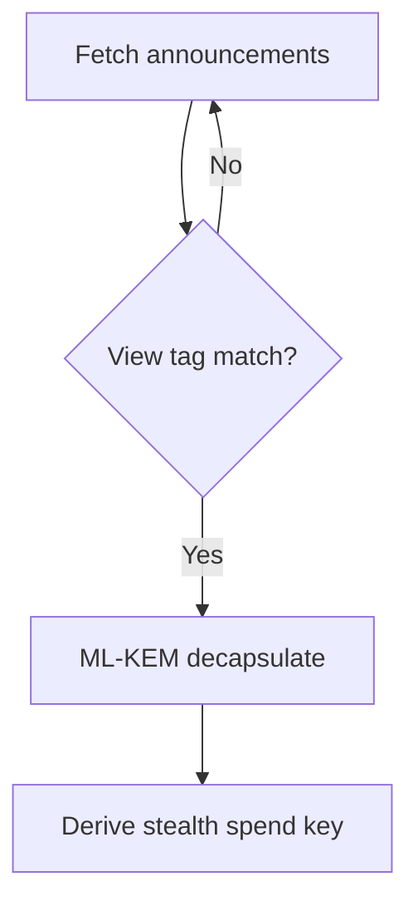

# Documentation Examples — Good vs Bad

Study these patterns before writing or editing SPECTER docs.

---

## Example 1: Opening paragraph

### Bad

> SPECTER is a cutting-edge, next-generation privacy protocol leveraging state-of-the-art post-quantum cryptography to revolutionize blockchain payments and make them completely secure against all attackers including quantum computers.

**Problems:** Hype words, overbroad security claim, no concrete actor or artifact.

### Good

> SPECTER lets a recipient publish one **meta-address** and receive each payment at a different **stealth address**. The on-chain **announcement** that helps the recipient detect a payment uses **ML-KEM-768**, so the viewing path remains confidential even if a future quantum adversary stores today's ciphertext.

**Why it works:** Names artifacts, scopes PQ claim to viewing path, no hype.

---

## Example 2: Quantum claims

### Bad

> All SPECTER payments are quantum-proof, so users never need to worry about quantum computers.

### Good

> ML-KEM-768 protects the **confidentiality of announcement ciphertext** against harvest-now-decrypt-later attacks. It does **not** hide payment amounts, sender identity, or the fact that a transaction occurred.

**Why it works:** Explicit scope and non-goals.

---

## Example 3: Tutorial step

### Bad

> Now just encapsulate the key and publish it.

### Good

> **Encapsulate** against the recipient's viewing public key to produce a ciphertext and shared secret:

> ```typescript
> const { ciphertext, sharedSecret } = await specter.encapsulate(viewingPk);
> ```

> **Verify:** `ciphertext` is exactly 1,088 bytes for ML-KEM-768.

**Why it works:** Verifiable checkpoint, exact size, code.

---

## Example 4: Comparison table cell

### Bad

| Feature | SPECTER | Others |
|---------|---------|--------|
| Privacy | ✅ Best | ❌ Bad |

### Good

| Recipient unlinkability | SPECTER | Classical stealth (ECDH viewing) |
|-------------------------|---------|----------------------------------|
| Mechanism | One-time stealth addresses + announcements | Same model |
| PQ viewing path | ML-KEM-768 (FIPS 203) | Vulnerable to future quantum decryption of stored ciphertext |
| On-chain announcement size | ~1 KB KEM ciphertext | Smaller ECDH payload |

**Why it works:** Specific axes, neutral tone, technically checkable.

---

## Example 5: Warning placement

### Bad

(Tutorial steps 1–8 with no warnings; step 9 at bottom: "Don't lose your keys.")

### Good

```mdx
<Steps>
  <Step title="Generate recipient keys">
    <Warning>
    The viewing secret key is required to detect incoming payments. If you lose it, you cannot scan for announcements sent to your meta-address. SPECTER cannot recover it.
    </Warning>

    ...
  </Step>
</Steps>
```

**Why it works:** Warning appears at point of risk.

---

## Example 6: View tag explanation

### Bad

> View tags encrypt the payment so only the recipient can see it.

### Good

> A **view tag** is a 1-byte value derived from the ML-KEM shared secret. Recipients use it as a fast filter: only announcements whose tag matches need full decapsulation. It does not provide secrecy by itself; the KEM ciphertext does.

**Why it works:** Correct role (filter vs encryption).

---

## Example 7: API error documentation

### Bad

> Sometimes errors happen. Check your request.

### Good

| Status | Body `code` | Meaning | Fix |
|--------|-------------|---------|-----|
| 401 | `unauthorized` | Missing or invalid API key | Set `Authorization: Bearer <key>` |
| 422 | `invalid_meta_address` | Malformed meta-address encoding | Regenerate via SDK; see [Keys API](/api/keys) |

**Why it works:** Actionable, specific.

---

## Example 8: Mermaid + prose redundancy

### Bad

> See the diagram below.

(Only diagram, no text summary.)

### Good

> Recipients scan published announcements in reverse chronological order. For each announcement, they compare the view tag, then decapsulate the ML-KEM ciphertext when the tag matches.



**Why it works:** Prose stands alone; diagram reinforces.

---

## Example 9: Roadmap vs shipped

### Bad

(In quickstart, step 3: "Enable multi-chain atomic swaps.")

### Good

(In quickstart: only shipped steps.)

(In `roadmap/yet-to-implement.mdx`: "**Planned:** multi-chain atomic swaps — not available in the current API.")

**Why it works:** Tutorials reflect reality; future work is labeled.

---

## Example 10: Link anchor text

### Bad

> For more information, [click here](/how-it-works/post-quantum-crypto).

### Good

> Read [Post-Quantum Cryptography in SPECTER](/how-it-works/post-quantum-crypto) for ML-KEM-768 parameters and derivation labels.

**Why it works:** Descriptive anchor; SEO and scannability.

---

## Example 11: Diátaxis discipline

### Bad

Single page titled "Getting Started" containing: install guide, full protocol spec, API reference for 12 endpoints, and FAQ.

### Good

Split into:

- `getting-started/quickstart.mdx` (tutorial)
- `getting-started/installation.mdx` (tutorial)
- `how-it-works/protocol-flow.mdx` (explanation)
- `api/introduction.mdx` + per-resource pages (reference)
- `faq.mdx` (reference)

---

## Example 12: Frontmatter description

### Bad

```yaml
description: "Crypto stuff"
```

### Good

```yaml
description: "How ML-KEM-768 encapsulation protects SPECTER announcement confidentiality against quantum harvest-now-decrypt-later attacks."
```

**Why it works:** Search-worthy, specific, accurate scope.

---

## Rewrite exercise

**Before:**

> Users should simply generate keys, which is easy, and then the quantum-safe protocol handles everything securely on-chain.

**After:**

> Generate a **spending key pair** and a **viewing key pair** in the SDK. Publish the encoded **meta-address** so senders can derive unique **stealth addresses** per payment. Announcements posted on-chain contain ML-KEM ciphertext; only the viewing secret key can decapsulate them.

Use this density and precision as your default.
