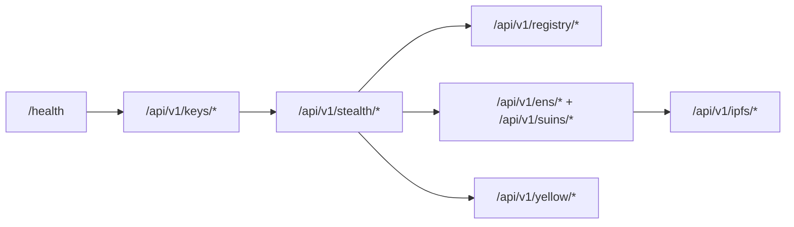

<CardGroup cols={3}>
  <Card title="Launch app" icon="rocket" href="https://specter-stealth.vercel.app/">
    Use the hosted interface while you test endpoint payloads.
  </Card>
  <Card title="Run quickstart" icon="bolt" href="/getting-started/quickstart">
    Execute a full create -> publish -> scan loop in minutes.
  </Card>
  <Card title="View API auth and errors" icon="shield" href="/api/auth-and-errors">
    Confirm error shapes and production hardening requirements.
  </Card>
</CardGroup>

## Base URL

- Local default: `http://localhost:3001`

## Route groups



## Integration path

<Steps>
  <Step title="Verify server health">
    Call `GET /health` and confirm `status: "ok"` before sending write requests.
  </Step>
  <Step title="Generate recipient keys">
    Call `POST /api/v1/keys/generate` and securely store secret fields.
  </Step>
  <Step title="Create and publish stealth announcement">
    Use `POST /api/v1/stealth/create`, then publish with `POST /api/v1/registry/announcements`.
  </Step>
  <Step title="Scan for discoveries">
    Use `POST /api/v1/stealth/scan` with your viewing/spending keys and optional filters.
  </Step>
</Steps>

## Health check examples

<Tabs>
  <Tab title="cURL">

```bash
curl -s http://localhost:3001/health | jq .
```

  </Tab>
  <Tab title="JavaScript">

```javascript
const res = await fetch("http://localhost:3001/health");
const data = await res.json();
console.log(data.status, data.version);
```

  </Tab>
</Tabs>

## Health response schema

<ParamField body="status" type="string" required>
Server status string (`"ok"` when healthy).
</ParamField>
<ParamField body="version" type="string" required>
Current backend package version.
</ParamField>
<ParamField body="uptime_seconds" type="integer" required>
Elapsed process uptime in seconds.
</ParamField>
<ParamField body="announcements_count" type="integer" required>
Current in-memory registry count.
</ParamField>
<ParamField body="use_testnet" type="boolean" required>
`true` when backend is configured for Sepolia/testnet.
</ParamField>

## Operational boundaries

<AccordionGroup>
  <Accordion title="Authentication">
    No HTTP auth middleware is implemented in current routes.
  </Accordion>
  <Accordion title="Rate limiting">
    No API-level rate limiter is implemented in current server code.
  </Accordion>
  <Accordion title="CORS">
    CORS allows any origin, method, and header (`CorsLayer::allow_origin(Any)` etc.).
  </Accordion>
</AccordionGroup>

<Warning>
Run production traffic behind your own gateway controls for auth, rate limiting, and abuse protection.
</Warning>

## Source references

- `../SPECTER/specter/specter-api/src/lib.rs`
- `../SPECTER/specter/specter-api/src/routes.rs`
- `../SPECTER/specter/specter-api/src/handlers.rs`
