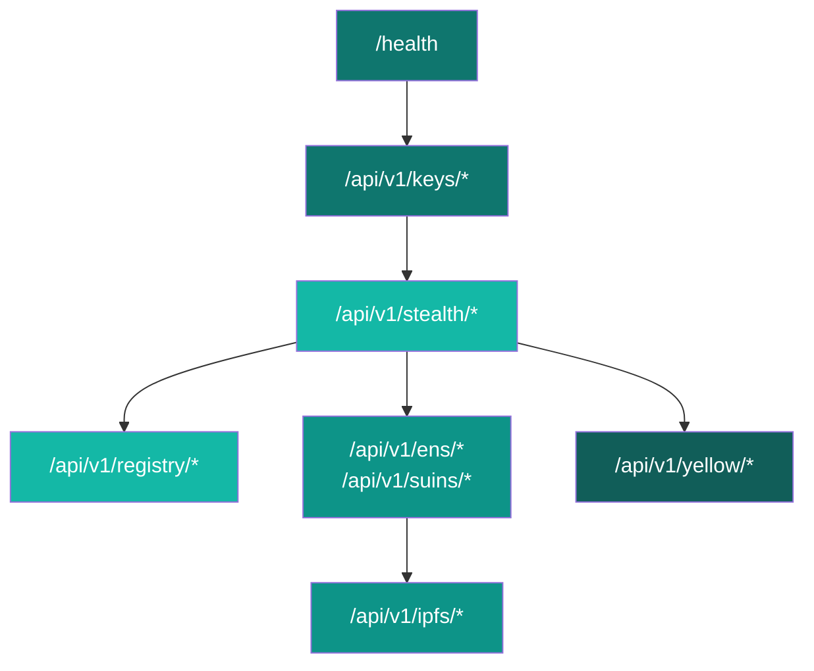

<CardGroup cols={3}>
  <Card title="Quickstart" icon="rocket" href="/getting-started/quickstart">
    Run the full flow in 4 API calls.
  </Card>
  <Card title="Stealth endpoints" icon="code" href="/api/stealth">
    Create and scan stealth payments.
  </Card>
  <Card title="Yellow endpoints" icon="chart-line" href="/api/yellow">
    Private trading channels.
  </Card>
</CardGroup>

## Base URLs

| Environment | URL |
|-------------|-----|
| **Production** | `https://backend.specterpq.com` |
| **Local dev** | `http://localhost:3001` |

## Endpoint map


```mermaid
flowchart TD
    Health["/health"] --> Keys["/api/v1/keys/*"]
    Keys --> Stealth["/api/v1/stealth/*"]
    Stealth --> Registry["/api/v1/registry/*"]
    Stealth --> Names["/api/v1/ens/*\n/api/v1/suins/*"]
    Names --> IPFS["/api/v1/ipfs/*"]
    Stealth --> Yellow["/api/v1/yellow/*"]

    style Health fill:#0F766E,color:#fff
    style Keys fill:#0F766E,color:#fff
    style Stealth fill:#14B8A6,color:#fff
    style Registry fill:#14B8A6,color:#fff
    style Names fill:#0d9488,color:#fff
    style IPFS fill:#0d9488,color:#fff
    style Yellow fill:#115E59,color:#fff
```

| Group | Endpoints | Purpose |
|-------|-----------|---------|
| **Keys** | `POST /keys/generate` | Generate ML-KEM-768 keypairs and meta-address |
| **Stealth** | `POST /stealth/create`, `POST /stealth/scan` | Create stealth payments, discover incoming payments |
| **Registry** | `POST /registry/announcements`, `GET /registry/announcements`, `GET /registry/stats` | Store and query announcements |
| **Names** | `GET /ens/resolve/:name`, `GET /suins/resolve/:name` | ENS and SuiNS name resolution |
| **IPFS** | `POST /ipfs/upload`, `GET /ipfs/:cid` | Meta-address storage and retrieval |
| **Yellow** | `POST /yellow/channel/*`, `GET /yellow/config` | Private channel operations |

## The integration loop

<Steps>
  <Step title="Health check" icon="heart-pulse">
    Confirm the backend is alive with `GET /health`.
  </Step>
  <Step title="Generate keys" icon="key">
    `POST /api/v1/keys/generate` returns spending/viewing keypairs and a meta-address.
  </Step>
  <Step title="Create stealth payment" icon="paper-plane">
    `POST /api/v1/stealth/create` with the recipient's meta-address.
  </Step>
  <Step title="Publish announcement" icon="bell">
    `POST /api/v1/registry/announcements` with the returned ciphertext and view tag.
  </Step>
  <Step title="Scan and recover" icon="radar">
    `POST /api/v1/stealth/scan` with recipient keys to find and recover payments.
  </Step>
</Steps>

## Quick health check

<Tabs>
  <Tab title="cURL">
```bash
curl -s https://backend.specterpq.com/health | jq .
```
  </Tab>
  <Tab title="JavaScript">
```javascript
const res = await fetch("https://backend.specterpq.com/health");
const data = await res.json();
console.log(data.status, data.version);
```
  </Tab>
  <Tab title="Python">
```python
import requests
res = requests.get("https://backend.specterpq.com/health")
print(res.json())
```
  </Tab>
</Tabs>

## Authentication and security

The API server includes built-in security middleware:

- **API key auth** for write endpoints (when `API_KEY` env var is set)
- **Per-IP rate limiting** (default: 10 req/s, 30 burst)
- **Security headers** (CSP, X-Frame-Options, X-Content-Type-Options)
- **Body size limits** to prevent abuse
- **CORS** configurable via `ALLOWED_ORIGINS`

<Warning>
If `API_KEY` is not configured, write routes are open. Always set an API key in production.
</Warning>

See [Auth and Errors](/api/auth-and-errors) for the full error contract and status codes.

---

<Callout icon="envelope" color="#0F766E">
  **Need help with the API?** Email pranshurastogi3196@gmail.com or open an issue on [GitHub](https://github.com/pranshurastogi/SPECTER/issues).
</Callout>
