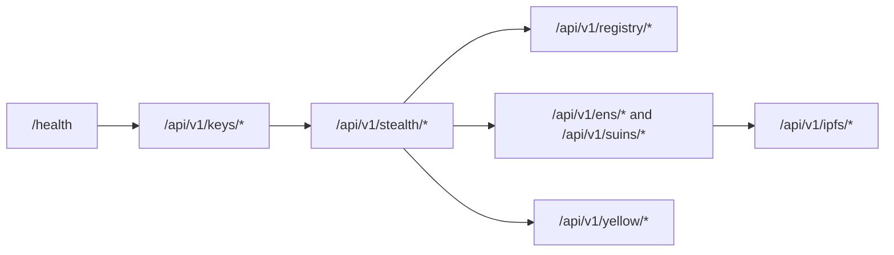

<CardGroup cols={3}>
  <Card title="Quickstart" icon="rocket" href="/getting-started/quickstart">
    Run the hosted flow against `backend.specterpq.com`.
  </Card>
  <Card title="Stealth endpoints" icon="code" href="/api/stealth">
    Create and scan stealth payments.
  </Card>
  <Card title="Yellow endpoints" icon="chart-line" href="/api/yellow">
    Explore the private-channel use case.
  </Card>
</CardGroup>

## Base URLs

- Hosted backend: `https://backend.specterpq.com`
- Local development: `http://localhost:3001`

## Route groups


```mermaid
flowchart LR
    A["/health"] --> B["/api/v1/keys/*"]
    B --> C["/api/v1/stealth/*"]
    C --> D["/api/v1/registry/*"]
    C --> E["/api/v1/ens/* and /api/v1/suins/*"]
    E --> F["/api/v1/ipfs/*"]
    C --> G["/api/v1/yellow/*"]
```

## The core integration loop

<Steps>
  <Step title="Check health">
    Confirm the backend is alive with `GET /health`.
  </Step>
  <Step title="Generate keys">
    Call `POST /api/v1/keys/generate` and store the secret fields carefully.
  </Step>
  <Step title="Create and publish">
    Create a stealth payload with `POST /api/v1/stealth/create`, then publish the returned announcement.
  </Step>
  <Step title="Scan">
    Call `POST /api/v1/stealth/scan` to recover matching discoveries.
  </Step>
</Steps>

## Health check examples

<Tabs>
  <Tab title="cURL">

```bash
curl -s https://backend.specterpq.com/health | jq .
```

  </Tab>
  <Tab title="JavaScript">

```javascript
const res = await fetch("https://backend.specterpq.com/health");
const data = await res.json();
console.log(data.status, data.version);
```

  </Tab>
</Tabs>

## What the current server actually includes

The API server wires in security middleware in `specter/specter-api/src/lib.rs` and `specter/specter-api/src/middleware.rs`.

That includes:

- API-key auth for mutating routes when `API_KEY` is configured
- per-IP rate limiting
- security headers
- body size limits
- CORS configuration from `ALLOWED_ORIGINS`

## Important caveat

<Warning>
Security behavior is environment-driven. If `API_KEY` is not configured, write routes are effectively open in dev mode.
</Warning>
