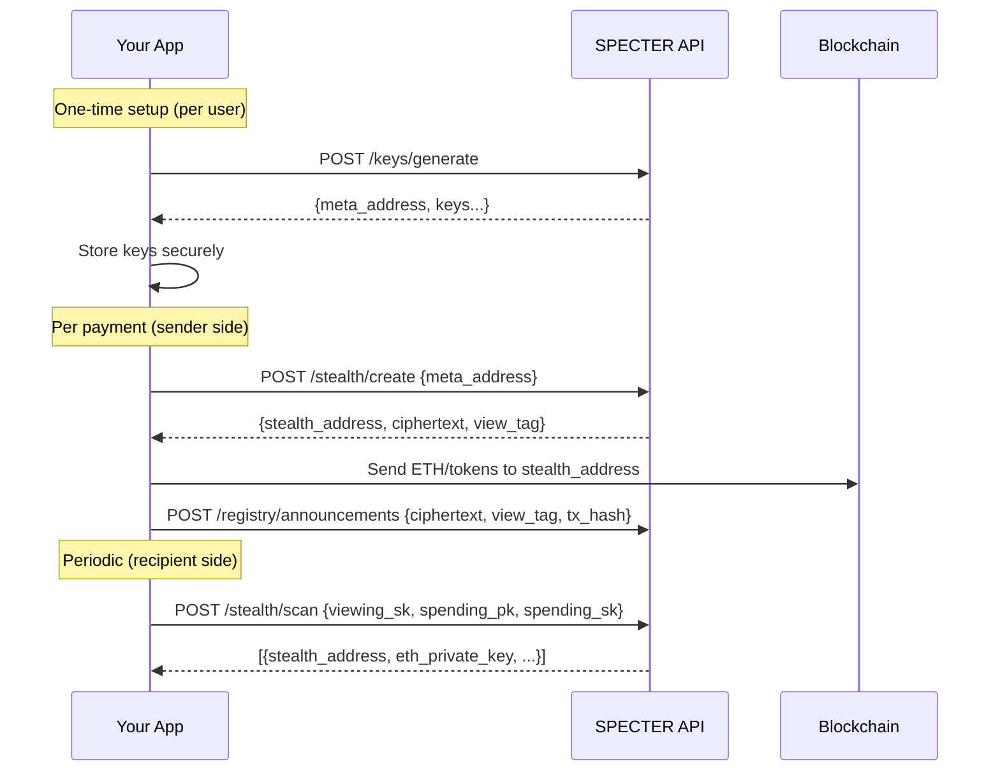

<Info>
Current implementation boundaries matter for integrators:

- The hosted API currently exposes backend key generation through `POST /api/v1/keys/generate`. Client-side key generation is tracked in [issue #18](https://github.com/pranshurastogi/SPECTER/issues/18).
- Payment discovery currently depends on the backend-managed announcement registry. Backend-independent recovery from on-chain announcements is tracked in [issue #16](https://github.com/pranshurastogi/SPECTER/issues/16).
</Info>

## Three integration patterns

Pick the one that fits your app:

<Tabs>
  <Tab title="API-first">
    Call the hosted backend directly from your server or client. Simplest approach. No Rust or infrastructure needed.

    **Best for:** Wallets, dApps, payment platforms that want to add stealth receiving.

    Base URL: `https://backend.specterpq.com`

    ```javascript
    // Generate keys for a new user
    const keys = await fetch("https://backend.specterpq.com/api/v1/keys/generate", {
      method: "POST"
    }).then(r => r.json());

    // Create a stealth payment
    const payment = await fetch("https://backend.specterpq.com/api/v1/stealth/create", {
      method: "POST",
      headers: { "Content-Type": "application/json" },
      body: JSON.stringify({ meta_address: recipientMetaAddress })
    }).then(r => r.json());

    // Send funds to payment.stealth_address, then publish announcement
    ```
  </Tab>
  <Tab title="Frontend-first">
    Use the SPECTER web app as a reference implementation or embed its components.

    **Best for:** Teams building privacy-focused UIs who want a working reference.

    The frontend source is at `SPECTER-web/src/` in the repo. Key patterns:
    - Type-safe API client: `SPECTER-web/src/lib/api.ts`
    - Key encryption for browser storage: `SPECTER-web/src/lib/crypto/`
    - Chain configuration: `SPECTER-web/src/lib/blockchain/chainConfig.ts`
    - Wallet and page flows: `SPECTER-web/src/pages/`
  </Tab>
  <Tab title="Self-hosted">
    Run the full SPECTER backend in your infrastructure.

    **Best for:** Projects that need full control, custom registry backends, or private deployments.

    See [Installation](/getting-started/installation) for Docker and manual setup.
  </Tab>
</Tabs>

## The integration loop

Every integration follows the same four-step loop:



## Key management

The most important integration decision is how you handle secret keys.

### Browser apps

SPECTER's frontend encrypts keys with AES-GCM and stores them in the browser. The user sets a password; the keys never leave the device unencrypted.

Reference: `SPECTER-web/src/lib/crypto/`

### Server apps

Store keys in your existing secrets management (AWS Secrets Manager, GCP Secret Manager, HashiCorp Vault, etc.). The `viewing_sk` and `spending_sk` are the critical secrets. Never log them, never send them to analytics.

### Mobile apps

Use the device's secure enclave/keychain. Same API calls, same key format (hex-encoded ML-KEM keys).

## Name service integration

If your users have ENS or SuiNS names, you can resolve them to meta-addresses automatically:

```javascript
// Resolve ENS name to meta-address
const resolved = await fetch("https://backend.specterpq.com/api/v1/ens/resolve", {
  method: "POST",
  headers: { "Content-Type": "application/json" },
  body: JSON.stringify({ name: "alice.eth" })
}).then(r => r.json());

// Use resolved.meta_address for stealth payment creation
```

## Security checklist

Before going to production:

- [ ] Secret keys (`viewing_sk`, `spending_sk`, `eth_private_key`) are never logged
- [ ] Scan responses are transmitted over HTTPS only
- [ ] Keys at rest are encrypted (not stored in plaintext)
- [ ] API key is configured for write endpoints in production
- [ ] Rate limiting is enabled
- [ ] CORS is restricted to your domain

## Error handling

The API returns standard HTTP status codes with JSON error bodies:

```json
{
  "error": "invalid_meta_address",
  "message": "Meta-address hex string is malformed or incorrect length"
}
```

Common errors:

| Status | Meaning |
|--------|---------|
| 400 | Invalid request (malformed keys, missing fields) |
| 401 | Missing or invalid API key (when configured) |
| 429 | Rate limited |
| 500 | Server error |

See [Auth and Errors](/api/auth-and-errors) for full documentation.

<CardGroup cols={2}>
  <Card title="API reference" icon="code" href="/api/introduction">
    Complete endpoint documentation.
  </Card>
  <Card title="Development setup" icon="wrench" href="/build/development-setup">
    Run the backend locally for testing.
  </Card>
</CardGroup>
