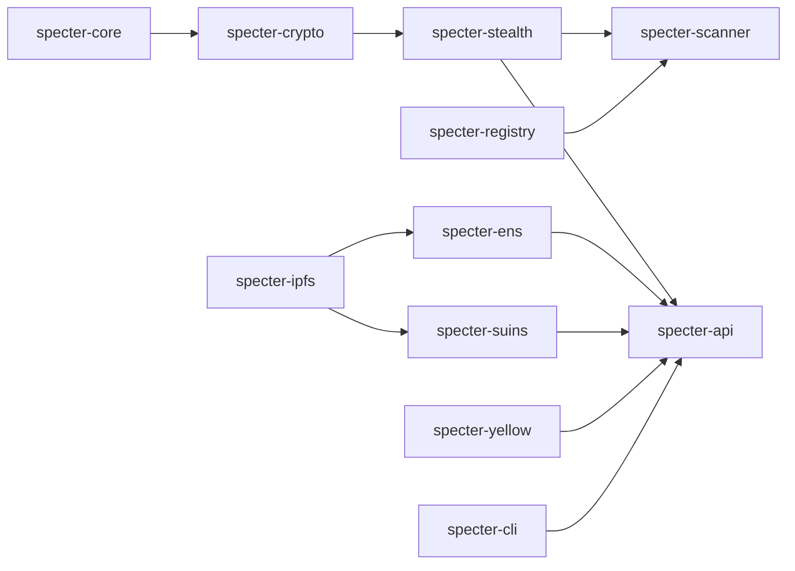

SPECTER is a Rust workspace split into focused crates.

## Workspace layout

## Crate responsibilities

| Crate | Responsibility |
| --- | --- |
| `specter-core` | Types, constants, traits, errors |
| `specter-crypto` | ML-KEM, SHAKE256, view tags, stealth key derivation |
| `specter-stealth` | Wallet, payment creation, payment discovery |
| `specter-registry` | Announcement storage (`MemoryRegistry`, `FileRegistry`) |
| `specter-scanner` | Batch scanning with progress and filtering |
| `specter-ipfs` | Pinata-backed IPFS upload/download |
| `specter-ens` | ENS lookup + IPFS fetch for meta-address resolution |
| `specter-suins` | SuiNS lookup + IPFS fetch for meta-address resolution |
| `specter-api` | Axum REST server |
| `specter-cli` | Command-line interface |
| `specter-yellow` | Yellow integration primitives and API-facing channel flows |

## Architecture notes

- API and CLI reuse the same core cryptographic crates.
- Registry is in-memory by default in API state.
- File persistence exists but is used explicitly through `FileRegistry`.
- ENS/SuiNS resolution is network lookups + IPFS retrieval.

## Source references

- `../SPECTER/specter/Cargo.toml`
- `../SPECTER/specter/specter-api/src/state.rs`
- `../SPECTER/specter/specter-registry/src/lib.rs`
