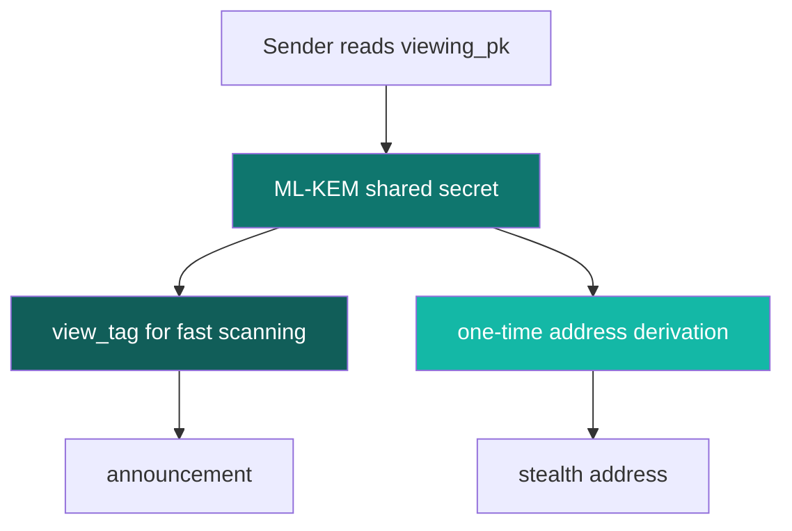

<Info>
The cryptography story in SPECTER has two layers: first, ML-KEM protects recipient discovery against long-term quantum risk; second, the current wallet-compatible spend path still bridges into today's classical Ethereum execution model. That separation is deliberate in the docs because it is visible in the code.
</Info>

## First: what does post-quantum mean?

It means preparing for a world where large quantum computers can break some of the public-key systems we use today.

Ethereum wallets and signatures are still built around elliptic-curve cryptography.

That works well against classical computers.

The long-term concern is that a cryptographically relevant quantum computer could use Shor's algorithm against that class of system.

For privacy protocols, that matters a lot because the evidence is public and long-lived.

## Why stealth systems care more than most products

A stealth system leaves behind durable public data:

- announcements
- ciphertexts
- identifiers
- sometimes recoverable public keys after spending

If the privacy layer depends on a system that later becomes breakable, an attacker can collect the data now and attack it later.

That is why SPECTER replaces classical ECDH-style recipient discovery with **ML-KEM-768**.

## What SPECTER uses today

The cryptography crate states this directly in `specter/specter-crypto/src/kyber.rs`:

- ML-KEM-768
- FIPS 203 aligned
- public key size: `1184` bytes
- secret key size: `2400` bytes
- ciphertext size: `1088` bytes
- shared secret size: `32` bytes

Those same sizes are referenced in `specter/specter-core/src/constants.rs`.

## The two jobs in SPECTER's crypto model

<CardGroup cols={2}>
  <Card title="Job 1: discovery privacy" icon="shield-lock">
    The sender uses `viewing_pk` to create a shared secret through ML-KEM.
  </Card>
  <Card title="Job 2: wallet compatibility" icon="wallet">
    The current implementation turns that shared secret into a usable `secp256k1` wallet key so the result can be spent in existing Ethereum flows.
  </Card>
</CardGroup>

## What is a view tag?

A **view tag** is the cheapest possible early filter.

SPECTER computes one byte from the shared secret and stores it in the announcement.

When you scan:

- most announcements fail the filter immediately
- only the likely matches need the full work

That logic appears throughout the crypto and discovery flow:

- `compute_view_tag` in `specter/specter-crypto/src/lib.rs`
- scan handling in `specter/specter-stealth/src/discovery.rs`

### Why a single byte helps

Because `1 / 256` announcements should match by chance on average.

So the filter rejects roughly `99.6%` of irrelevant entries before you do more expensive processing.

## The simple mental model

## What SPECTER does not claim

<Warning>
The current docs do not claim fully post-quantum spending, because the code does not implement that yet.
</Warning>

The honest line is:

- **recipient discovery**: post-quantum
- **wallet-compatible spending**: classical

That distinction comes from `specter/specter-crypto/src/derive.rs`, where the shared secret is turned into a valid `secp256k1` seed and then an Ethereum address.

## Where this can go next

Future-friendly paths exist, but they are not implemented in this repo today:

1. **ERC-4337 smart accounts** can use custom validation logic, so a smart account could verify a post-quantum signature scheme instead of ECDSA. The standard leaves signature validation to the account implementation itself. Source: [ERC-4337](https://eips.ethereum.org/EIPS/eip-4337).
2. **EIP-8141 frame transactions** are now a draft as of January 29, 2026 and explicitly aim to let accounts define transaction validity with arbitrary cryptographic systems. Source: [EIP-8141](https://eips.ethereum.org/EIPS/eip-8141).

Those are migration directions, not current product claims.
