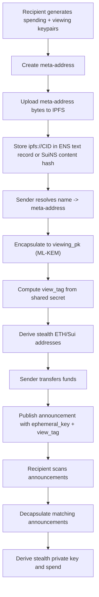

## Payment lifecycle

## Registration details

- Recipient creates two ML-KEM keypairs: spending and viewing
- Recipient builds `MetaAddress { version, spending_pk, viewing_pk }`
- Meta-address is serialized and uploaded to IPFS
- Name service record points to CID (`ipfs://...`)

## Sending details

- Sender resolves name to recipient meta-address
- Sender encapsulates to `viewing_pk`
- Sender computes `view_tag`
- Sender derives stealth address from shared secret and `spending_pk`
- Sender publishes announcement to registry

## Discovery details

- Recipient scans announcements and decapsulates
- If computed view tag matches announcement view tag, payment is for recipient
- Recipient derives ETH-compatible private key from discovered stealth material

<Warning>
The backend does not include an on-chain announcer contract yet. Announcement publishing in current code is API/registry based.
</Warning>

## Source references

- `../SPECTER/specter/specter-stealth/src/payment.rs`
- `../SPECTER/specter/specter-stealth/src/discovery.rs`
- `../SPECTER/specter/specter-api/src/handlers.rs`
- `../SPECTER/specter/specter-ens/src/resolver.rs`
- `../SPECTER/specter/specter-suins/src/resolver.rs`
