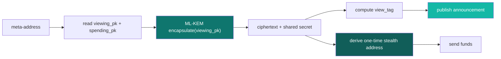

<Info>
The protocol has six logical stages: key creation, profile publishing, payment creation, announcement publishing, recipient scanning, and recovery. Each stage exists to separate public discovery from private ownership while keeping the result usable in current wallets.
</Info>

## The full process

This page answers the question a new user usually has:

**What exactly happens between “someone wants to pay me” and “I can spend the funds”?**

## Step 1: you create your public receiving profile

The backend key generation route creates two ML-KEM keypairs:

- one for `spending_pk` / `spending_sk`
- one for `viewing_pk` / `viewing_sk`

That happens in `specter/specter-api/src/handlers.rs` inside `generate_keys`.

Those public keys are packed into your **meta-address**.

## Step 2: you publish that profile where people can find it

SPECTER supports name resolution flows so a sender can start from a human-readable name instead of raw bytes.

Current docs-backed paths:

- ENS for `.eth`
- SuiNS for `.sui`

The flow is:

1. Upload the meta-address payload to IPFS.
2. Point your ENS or SuiNS record at that content.
3. Let the sender resolve your name into your meta-address.

## Step 3: the sender creates the payment

This is the sender-side logic in `specter/specter-stealth/src/payment.rs`.

At a high level:

1. The sender reads your `viewing_pk`.
2. They run ML-KEM encapsulation to produce:
   - a ciphertext
   - a shared secret
3. They compute a 1-byte `view_tag`.
4. They derive a one-time Ethereum address and Sui address from the shared secret plus your `spending_pk`.
5. They package the ciphertext and `view_tag` into an announcement.


```mermaid
flowchart LR
    A["meta-address"] --> B["read viewing_pk + spending_pk"]
    B --> C["ML-KEM encapsulate(viewing_pk)"]
    C --> D["ciphertext + shared secret"]
    D --> E["compute view_tag"]
    D --> F["derive one-time stealth address"]
    E --> G["publish announcement"]
    F --> H["send funds"]

    style C fill:#0f766e,color:#fff
    style F fill:#115e59,color:#fff
    style G fill:#14b8a6,color:#fff
```

## Step 4: the sender publishes the announcement

The announcement is the public discovery object.

In the current type definition (`specter/specter-core/src/types/announcement.rs`), it contains:

- `ephemeral_key`
- `view_tag`
- `timestamp`
- optional `channel_id`
- optional `tx_hash`
- optional `amount`
- optional `chain`

This is what lets you scan later without revealing your identity to everyone else.

## Step 5: you scan

The recipient-side discovery flow lives in `specter/specter-stealth/src/discovery.rs`.

The scan process is:

1. Load announcements from the registry.
2. For each announcement, try the fast check first:
   - decapsulate
   - recompute the expected `view_tag`
3. Keep only the announcements that match.
4. Derive the stealth output for the matching entries.

The API surface for this is `POST /api/v1/stealth/scan`.

## Step 6: you recover a spendable result

The current API returns:

- `stealth_address`
- `stealth_sui_address`
- `stealth_sk`
- `eth_private_key`

That response is assembled in `specter/specter-api/src/handlers.rs`.

### Why is `eth_private_key` there?

Because the current implementation is designed to work with existing Ethereum wallet patterns.

The actual address derivation path in `specter/specter-crypto/src/derive.rs` creates a valid `secp256k1` seed and then derives the Ethereum address from that seed.

That is the compatibility bridge.

It is also the reason the spend side is not yet fully post-quantum.

## The three objects that matter most

| Object | What it does | Who uses it |
| --- | --- | --- |
| Meta-address | Public receiving profile | Sender and recipient |
| Announcement | Public discovery breadcrumb | Sender publishes, recipient scans |
| `eth_private_key` result | Spendable wallet output | Recipient |

## What the sender sees vs what the recipient sees

<Tabs>
  <Tab title="Sender view">
    The sender needs only the recipient's meta-address or name record.

    They do not need the recipient's wallet address up front.

    They call:

    ```bash
    curl -s -X POST https://backend.specterpq.com/api/v1/stealth/create \
      -H "Content-Type: application/json" \
      -d '{"meta_address":"<RECIPIENT_META_ADDRESS>"}'
    ```
  </Tab>
  <Tab title="Recipient view">
    The recipient needs their secret keys to scan.

    They call:

    ```bash
    curl -s -X POST https://backend.specterpq.com/api/v1/stealth/scan \
      -H "Content-Type: application/json" \
      -d '{
        "viewing_sk":"<HEX_VIEWING_SK>",
        "spending_pk":"<HEX_SPENDING_PK>",
        "spending_sk":"<HEX_SPENDING_SK>"
      }'
    ```
  </Tab>
</Tabs>

## Important boundary

<Info>
SPECTER makes the **receiving path** much more private and much more future-resistant than classical stealth address systems, but the current wallet-compatible **spend path** still lands on `secp256k1`.
</Info>

Read **[Quantum safety boundaries](/core-concepts/quantum-safety-boundaries)** next if you want the precise explanation.
