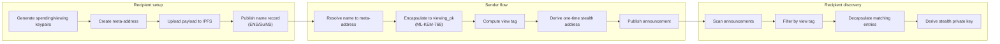

## End-to-end payment lifecycle

```mermaid
flowchart LR
    subgraph R["Recipient setup"]
      A["Generate spending/viewing keypairs"] --> B["Create meta-address"]
      B --> C["Upload payload to IPFS"]
      C --> D["Publish name record\n(ENS/SuiNS)"]
    end

    subgraph S["Sender flow"]
      E["Resolve name to meta-address"] --> F["Encapsulate to viewing_pk\n(ML-KEM-768)"]
      F --> G["Compute view tag"]
      G --> H["Derive one-time stealth address"]
      H --> I["Publish announcement"]
    end

    subgraph D2["Recipient discovery"]
      J["Scan announcements"] --> K["Filter by view tag"]
      K --> L["Decapsulate matching entries"]
      L --> M["Derive stealth private key"]
    end

    D --> E
    I --> J
```

## Registration details

- Recipient creates two ML-KEM keypairs: spending and viewing.
- Recipient builds `MetaAddress { version, spending_pk, viewing_pk }`.
- Meta-address bytes are uploaded to IPFS.
- Name service record points to CID (`ipfs://...`).

## Sending details

- Sender resolves the recipient name to a meta-address.
- Sender encapsulates to `viewing_pk` and computes a view tag.
- Sender derives a one-time stealth address and sends funds.
- Sender publishes an announcement containing `ephemeral_key` and `view_tag`.

## Discovery details

- Recipient scans announcements.
- Recipient uses view tags to reject non-matching announcements quickly.
- Recipient decapsulates matching announcements and derives spendable stealth key material.

<Warning>
Announcement publishing is API/registry-based in the current backend. A production announcer contract flow is not documented as implemented here.
</Warning>
