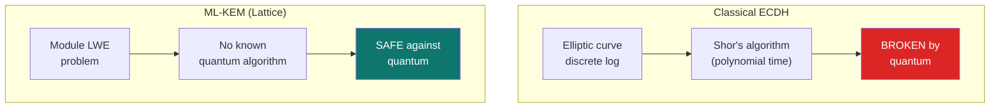

## You don't need a physics degree for this

Post-quantum cryptography sounds intimidating. It's not. Here's the whole story in plain language, with enough technical detail for the curious.

## What quantum computers actually threaten

Today's public-key cryptography (RSA, ECDSA, ECDH) relies on math problems that classical computers find extremely hard:

- **Factoring large numbers** (RSA)
- **Computing discrete logarithms on elliptic curves** (ECDSA, ECDH)

In 1994, Peter Shor published an algorithm that solves both of these problems efficiently on a quantum computer. Not faster. **Efficiently**. The difference between "takes billions of years" and "takes hours."

The catch: nobody has a quantum computer powerful enough to run Shor's algorithm on real cryptographic keys yet. Current estimates put that at 10-15 years away. But the research is accelerating.

## Why 10-15 years away matters today

Here's the scenario that keeps cryptographers up at night:

**Harvest-now, decrypt-later.**

An adversary records encrypted data today. They store it. It's cheap to store data. Then, in 2035 or 2040, when a quantum computer is available, they decrypt everything retroactively.

For most encrypted communications, this is a known risk. But for blockchains, it's worse:

- **Blockchain data is permanent.** You can't delete an announcement from the chain.
- **The data is public.** Anyone can collect it. No need to intercept traffic.
- **Privacy systems leave durable cryptographic artifacts.** Ciphertexts, ephemeral public keys, identifiers.

If a privacy system uses classical crypto today, all the private payments it handles are potentially vulnerable to future quantum attacks. That's a betrayal of the privacy promise.

## How classical stealth addresses work (and break)

Classical stealth systems (ERC-5564 schemeId 1, Umbra) use **ECDH** (Elliptic Curve Diffie-Hellman):

```
Sender:   picks random scalar r, computes R = r*G (ephemeral public key)
          computes shared_secret = r * recipient_public_key
Recipient: computes shared_secret = private_key * R
```

Both sides arrive at the same shared secret. From it, they derive the stealth address.

The problem: `R` (the ephemeral public key) is stored on-chain in the announcement. A quantum attacker can compute `r` from `R` using Shor's algorithm, then derive the shared secret, then identify the recipient.

## How ML-KEM works (and doesn't break)

ML-KEM (Module Lattice-based Key Encapsulation Mechanism) replaces ECDH with math based on **lattice problems**.

Instead of elliptic curves, ML-KEM works with polynomial matrices plus random noise:

```
Key generation: Create a secret polynomial vector s
                Public key = A*s + e  (where A is random, e is small noise)

Encapsulation:  Sender uses public key to create:
                - A ciphertext (encrypted shared secret)
                - A shared secret (32 bytes)

Decapsulation:  Recipient uses secret key to recover the shared secret
```

The security relies on the **Module Learning With Errors (MLWE)** problem: given the noisy product `A*s + e`, recovering `s` is computationally hard. No quantum algorithm solves this efficiently. No classical algorithm does either.



## Why ML-KEM-768 specifically?

NIST (the US National Institute of Standards and Technology) evaluated dozens of post-quantum proposals over 8 years. In August 2024, they published the final standard: **FIPS 203** (ML-KEM).

ML-KEM comes in three sizes:

| Variant | Security level | Public key | Ciphertext | Use case |
|---------|---------------|------------|------------|----------|
| ML-KEM-512 | Category 1 (AES-128) | 800 B | 768 B | General use |
| **ML-KEM-768** | **Category 3 (AES-192)** | **1,184 B** | **1,088 B** | **Long-term protection** |
| ML-KEM-1024 | Category 5 (AES-256) | 1,568 B | 1,568 B | Maximum security |

SPECTER uses **ML-KEM-768** because on-chain data is permanent. You want more than the minimum security margin when the data you're protecting will exist for decades.

Category 3 provides 128+ bits of quantum security, equivalent to AES-192 against quantum adversaries. Overkill for a chat message that expires tomorrow. Appropriate for blockchain data that lives forever.

## Other post-quantum approaches (and why not)

| Algorithm | Type | Why SPECTER doesn't use it |
|-----------|------|---------------------------|
| NTRU | Lattice | More complex security history, less community confidence |
| Classic McEliece | Code-based | Public keys are ~1 MB. Way too large for on-chain meta-addresses. |
| SPHINCS+ / SLH-DSA | Hash-based | Signature scheme, not KEM. SPECTER needs key encapsulation for the shared secret. |
| FALCON | Lattice | Good for signatures, but ML-KEM is standardized for encapsulation. |

ML-DSA (the signature counterpart to ML-KEM) is relevant for the future spending path. SPECTER's ERC proposal specifies ML-DSA-65 for stealth key signing when smart accounts support it. See the [ERC Proposal](/deep-dive/erc-proposal).

## The NIST timeline

| Date | Event |
|------|-------|
| 2016 | NIST opens post-quantum standardization competition |
| 2017 | 82 submissions received |
| 2020 | Round 3 finalists announced (including CRYSTALS-Kyber, now ML-KEM) |
| 2022 | ML-KEM selected for standardization |
| **Aug 2024** | **FIPS 203 (ML-KEM) published as final standard** |
| 2024-present | Migration begins across TLS, Signal, Chrome, iMessage |

SPECTER is part of this migration wave. The crypto industry is adopting ML-KEM. Blockchain privacy systems should too.

## What about Ethereum itself?

Ethereum's consensus uses BLS signatures (not broken by quantum). But user wallets use ECDSA over secp256k1 (broken by quantum).

SPECTER's receiving layer is already post-quantum. The spending layer depends on Ethereum's wallet model. Two paths forward exist:

1. **ERC-4337 smart accounts** - Custom signature verification, could use ML-DSA today
2. **EIP-8141 frame transactions** - Native PQ transaction support (draft stage)

Read more in [Security Boundaries](/how-it-works/security-boundaries).

## Recommended reading

- [NIST FIPS 203 (ML-KEM)](https://csrc.nist.gov/pubs/fips/203/final) - The standard itself
- [EPF Wiki: Post-Quantum Cryptography](https://epf.wiki/#/wiki/Cryptography/post-quantum-cryptography) - Ethereum Protocol Fellowship overview
- [ERC-5564](https://eips.ethereum.org/EIPS/eip-5564) - The stealth address standard SPECTER extends
- [SPECTER's ERC Proposal](/deep-dive/erc-proposal) - The formal post-quantum extension

<CardGroup cols={2}>
  <Card title="ML-KEM in SPECTER's code" icon="code" href="/how-it-works/post-quantum-crypto">
    How ML-KEM-768 is actually implemented in the Rust crates.
  </Card>
  <Card title="Security boundaries" icon="shield" href="/how-it-works/security-boundaries">
    What's PQ-safe today and the path to full coverage.
  </Card>
</CardGroup>
