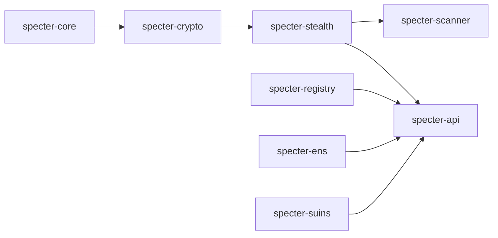

## Key dependency chain

## Contributor tips

- Start in `specter-core` when adding or changing shared types.
- Keep serialization contracts consistent with API DTOs.
- Prefer adding crate-level tests for any cryptographic or flow change.
