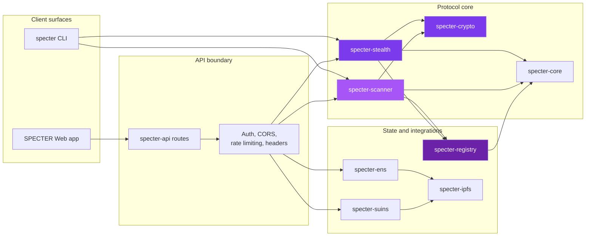
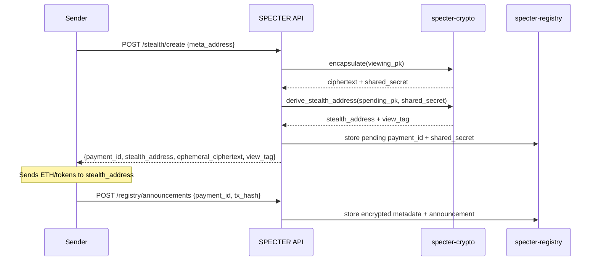
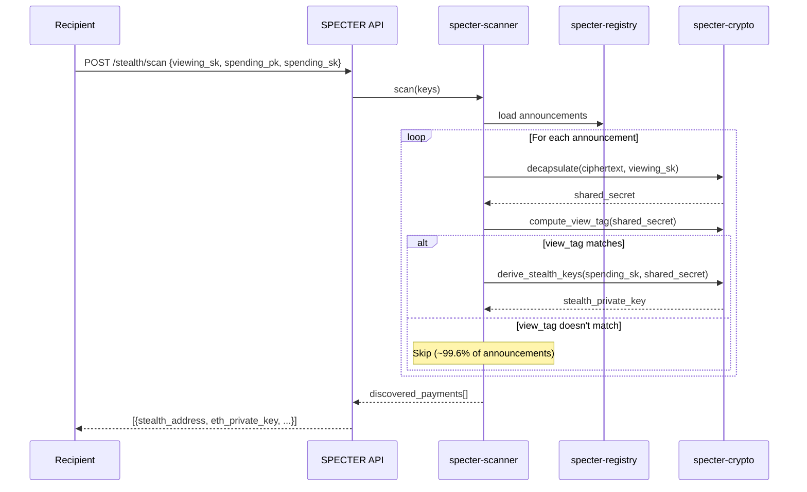

## System overview

SPECTER is a Rust backend + React frontend with a clean separation between cryptographic operations, API surface, and storage.

## The Rust workspace

SPECTER's backend is organized as a Cargo workspace. Each crate has a single responsibility:

| Crate | Purpose |
|-------|---------|
| **specter-core** | Shared types (`KeyPair`, `MetaAddress`, `Announcement`), error types, constants |
| **specter-chain** | On-chain announcer bindings, calldata recovery, and chain indexing helpers |
| **specter-crypto** | ML-KEM-768 encapsulation/decapsulation, view tags, SHAKE-256 derivation |
| **specter-stealth** | Payment creation (`create_stealth_payment`) and discovery (`scan_announcement`) |
| **specter-scanner** | Batch scanning with progress callbacks, resumable scans |
| **specter-registry** | Announcement storage: in-memory (dev) or Turso/libSQL (production) |
| **specter-ens** | ENS name resolution to IPFS-hosted meta-addresses |
| **specter-suins** | SuiNS name resolution |
| **specter-ipfs** | IPFS meta-address storage via Pinata gateway |
| **specter-api** | Axum REST server, route handlers, middleware, DTOs |
| **specter-cli** | CLI tool for generate, create, scan, bench, serve |

## Data flow

### Sending a payment

### Scanning for payments

## Frontend

The React frontend (`SPECTER-web/`) provides:

- **Generate Keys** page - Create ML-KEM keypairs and save encrypted to browser
- **Send Payment** page - Resolve names, create stealth payments
- **Scan Payments** page - Discover incoming payments

Keys are stored in an encrypted browser vault using AES-GCM. The frontend calls the same REST API documented in the API reference.

## Deployment

The backend runs on Google Cloud Run:

- Docker multi-stage build (Rust 1.88 builder + Debian slim runtime)
- Auto-scaling: 0-10 instances
- 512Mi memory, 1 CPU per instance
- Concurrency: 80 requests per instance
- Turso (libSQL) for production announcement storage
- Secrets managed via Google Secret Manager

## Registry backends

| Backend | Use case | Config |
|---------|----------|--------|
| Memory | Development, testing | `REGISTRY_BACKEND=memory` (default) |
| Turso | Production | `REGISTRY_BACKEND=turso` + `TURSO_DATABASE_URL` |

The registry interface is pluggable. Both backends implement the same `AnnouncementRegistry` trait, so the rest of the system doesn't care which one is active.

<CardGroup cols={2}>
  <Card title="Development setup" icon="tools" href="/build/development-setup">
    Set up the backend and frontend locally.
  </Card>
  <Card title="API reference" icon="code" href="/api/introduction">
    Full endpoint documentation.
  </Card>
</CardGroup>
