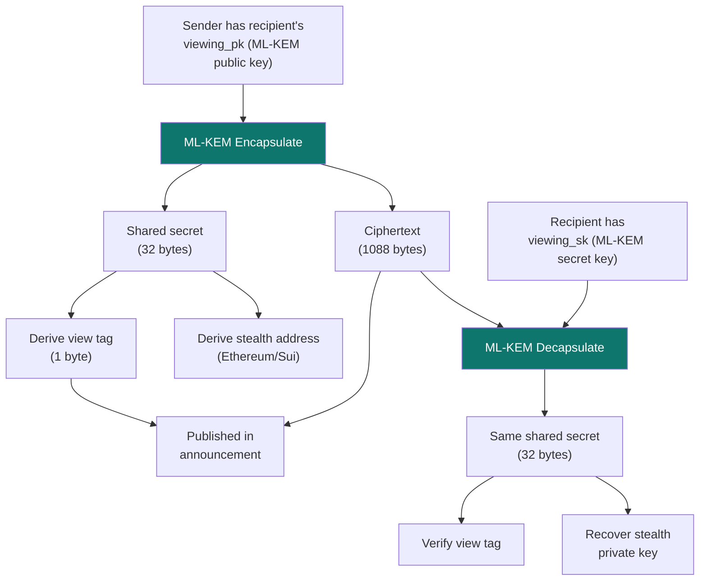

## ML-KEM-768: the crypto behind SPECTER

SPECTER replaces the classical ECDH key exchange with **ML-KEM-768** (Module Lattice-based Key Encapsulation Mechanism). It's standardized by NIST as [FIPS 203](https://csrc.nist.gov/pubs/fips/203/final) and is the recommended post-quantum KEM for general use.

<Frame caption="ML-KEM-768 encapsulation and decapsulation flow in SPECTER">
  
</Frame>

## What ML-KEM does in one paragraph

ML-KEM lets a sender create a shared secret with a recipient using only the recipient's public key. The sender gets a ciphertext (encrypted blob) and a shared secret. The recipient decapsulates the ciphertext with their private key to recover the same shared secret. No one else can recover it, even with a quantum computer.

## How it fits into SPECTER



Two jobs happen with the shared secret:

1. **View tag derivation** - `SHAKE-256("SPECTER_VIEW_TAG" || shared_secret)` produces a 1-byte filter
2. **Stealth key derivation** - `SHAKE-256("SPECTER_STEALTH_PK" || shared_secret)` combined with `spending_pk` produces the one-time address

Both use domain-separated SHAKE-256, so different derivations from the same secret never collide.

## Why ML-KEM-768 specifically?

| Parameter | ML-KEM-512 | ML-KEM-768 | ML-KEM-1024 |
|-----------|------------|------------|-------------|
| NIST security category | 1 (AES-128) | **3 (AES-192)** | 5 (AES-256) |
| Public key size | 800 B | **1,184 B** | 1,568 B |
| Ciphertext size | 768 B | **1,088 B** | 1,568 B |
| Security margin | Moderate | **Strong** | Very strong |

ML-KEM-768 hits the sweet spot: strong enough for long-term on-chain data (NIST Category 3 = AES-192 equivalent against quantum), while keeping key sizes manageable.

SPECTER's implementation uses the RustCrypto `ml-kem` crate, which is:
- Pure Rust (no C dependencies, WASM compatible)
- Constant-time operations (timing attack resistant)
- Memory-safe (`#![forbid(unsafe_code)]`)
- Secret keys are zeroized on drop

## The math (simplified)

Classical ECDH relies on the **elliptic curve discrete logarithm problem**: given points P and Q = kP on a curve, finding k is hard. Shor's algorithm solves this efficiently on a quantum computer.

ML-KEM relies on the **Module Learning With Errors (MLWE)** problem: given a noisy linear system over polynomial rings, recovering the secret is hard. No quantum algorithm is known to solve this efficiently.

The security assumption is fundamentally different:

| | Classical (ECDH) | Post-Quantum (ML-KEM) |
|---|---|---|
| Hard problem | Discrete logarithm | MLWE (lattice) |
| Quantum attack | Shor's algorithm (polynomial time) | None known |
| Data structure | Elliptic curve points | Polynomial matrices + noise |

## Key sizes in context

ML-KEM keys are larger than EC keys. Here's what that means practically:

```
Meta-address (both public keys):
  spending_pk (1,184 bytes) + viewing_pk (1,184 bytes) = 2,368 bytes

  vs. classical stealth meta-address: ~66 bytes

Announcement ciphertext:
  1,088 bytes per announcement

  vs. classical ephemeral public key: 33 bytes
```

This is a real storage and gas cost increase. But the data in announcements is **permanent**. It sits on-chain (or in the registry) forever. Protecting permanent data with quantum-resistant crypto is a tradeoff worth making.

## Constant-time everything

SPECTER's crypto layer uses the `subtle` crate for constant-time comparisons, preventing timing side-channel attacks. The `zeroize` crate ensures secret key material is wiped from memory when no longer needed.

Every crate in the workspace enforces `#![forbid(unsafe_code)]`.

<CardGroup cols={2}>
  <Card title="View tags and scanning" icon="filter" href="/how-it-works/view-tags-and-scanning">
    How SPECTER filters announcements efficiently.
  </Card>
  <Card title="Security boundaries" icon="shield" href="/how-it-works/security-boundaries">
    What's quantum-safe today and what isn't.
  </Card>
</CardGroup>
