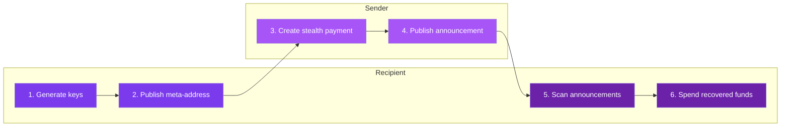

## From payment to spendable funds

The protocol has six stages. Each one exists to separate public discovery from private ownership while keeping the result usable in today's wallets.



---

## Stage 1: Generate your keys

The backend generates two ML-KEM-768 keypairs:

- **Spending keypair** (`spending_pk` / `spending_sk`) - determines where money lands
- **Viewing keypair** (`viewing_pk` / `viewing_sk`) - lets you find your payments

These are bundled into your **meta-address**: the public-facing profile that senders use.

```bash
curl -s -X POST https://backend.specterpq.com/api/v1/keys/generate | jq .
```

Response includes `meta_address`, `spending_pk`, `spending_sk`, `viewing_pk`, `viewing_sk`.

<Frame caption="Setup: key generation produces ML-KEM-768 spending and viewing keypairs, bundled into one meta-address">
  
</Frame>

---

## Stage 2: Publish your meta-address

Make your meta-address discoverable. Two options:

**ENS (Ethereum):** Upload meta-address to IPFS, set your ENS text record to point at the IPFS CID. Senders resolve `alice.eth` to your meta-address automatically.

**SuiNS (Sui):** Same pattern with Sui name records.

Or just share the raw meta-address string directly. Name services are convenient, not required.

---

## Stage 3: Sender creates the payment

This is where ML-KEM does its work. The sender:

1. Reads your `viewing_pk` from the meta-address
2. Runs **ML-KEM encapsulation** to produce:
   - A **ciphertext** (1,088 bytes) - this is the encrypted hint
   - A **shared secret** (32 bytes) - known to both sender and recipient
3. Computes a 1-byte **view tag** from the shared secret
4. Derives a **stealth address** (Ethereum and/or Sui) from the shared secret + your `spending_pk`

```bash
curl -s -X POST https://backend.specterpq.com/api/v1/stealth/create \
  -H "Content-Type: application/json" \
  -d '{"meta_address":"<RECIPIENT_META_ADDRESS>"}' | jq .
```

The sender then sends ETH/tokens to the returned `stealth_address`.

<Frame caption="Send: ML-KEM-768 encapsulation creates the shared secret, a one-time stealth address, and a view tag">
  
</Frame>

---

## Stage 4: Sender posts an announcement

The announcement is the public breadcrumb. It contains:

| Field | Purpose |
|-------|---------|
| `payment_id` | Server-held pending payment binding from `/stealth/create` |
| `tx_hash` | Monad announce transaction hash in dev mode |
| `payment_tx_hash` | Source-chain payment transaction hash (optional) |
| `source_chain_id` | EIP-155 source-chain ID (optional) |
| `amount` | Payment amount (optional) |
| `chain` | Source chain name (optional) |
| `token` | ERC-20 token contract for payment verification (optional) |

```bash
curl -s -X POST https://backend.specterpq.com/api/v1/registry/announcements \
  -H "Content-Type: application/json" \
  -d '{
    "payment_id":"<PAYMENT_ID_FROM_STEALTH_CREATE>",
    "tx_hash":"0x...",
    "amount":"0.1",
    "chain":"ethereum"
  }' | jq .
```

Preferred publishes use the server-held shared secret to encrypt payment metadata into a 93-byte blob. The fallback `announcement` path emits 77-byte plaintext metadata because the server has no shared secret.

---

## Stage 5: Recipient scans

This is the discovery process. The recipient:

1. Loads announcements from the registry
2. For each announcement, decapsulates the ciphertext using `viewing_sk`
3. Computes the expected view tag from the shared secret
4. **Fast path:** if the view tag doesn't match, skip (filters ~99.6% of announcements)
5. **Full path:** if it matches, derive the stealth address and compare

```bash
curl -s -X POST https://backend.specterpq.com/api/v1/stealth/scan \
  -H "Content-Type: application/json" \
  -d '{
    "viewing_sk":"<HEX>",
    "spending_pk":"<HEX>",
    "spending_sk":"<HEX>"
  }' | jq .
```

<Frame caption="Scanning: view tags filter roughly 99.6% of announcements, then decapsulation recovers the stealth key">
  
</Frame>

---

## Stage 6: Spend the funds

The scan returns everything needed to spend:

| Field | What it is |
|-------|-----------|
| `stealth_address` | The Ethereum address holding the funds |
| `stealth_sui_address` | The Sui address (if applicable) |
| `eth_private_key` | The derived private key for spending |

Import the private key into any Ethereum wallet and spend normally.

<Warning>
The scan response contains wallet secret material (`eth_private_key`, `stealth_sk`). Treat it like a seed phrase. Never log it, never expose it in analytics.
</Warning>

---

## The three objects that matter

| Object | What it does | Who holds it |
|--------|-------------|-------------|
| **Meta-address** | Public receiving profile | Published by recipient, read by senders |
| **Announcement** | Encrypted breadcrumb for discovery | Published by sender, scanned by recipient |
| **Stealth private key** | Controls the funds | Only the recipient |

---

## What sender and recipient each see

<Tabs>
  <Tab title="Sender's perspective">
    The sender needs only the recipient's meta-address or name.

    They never learn the recipient's real wallet address. They derive a fresh stealth address, send funds to it, and post an announcement. From their side, it's three API calls.
  </Tab>
  <Tab title="Recipient's perspective">
    The recipient periodically scans the announcement registry with their viewing key.

    When they find a match, they recover the private key for that stealth address and can spend the funds whenever they want. The scanning process takes 1-2 seconds for 100k announcements.
  </Tab>
  <Tab title="Observer's perspective">
    An observer sees a payment to a random-looking address and an announcement in the registry.

    Without the recipient's viewing key, they can't determine who the payment is for. The ML-KEM ciphertext in the announcement is quantum-resistant.
  </Tab>
</Tabs>

---

## The security split

The receiving path (stages 1-5) uses ML-KEM-768 and is post-quantum safe.

The spending path (stage 6) produces a secp256k1 key for Ethereum wallet compatibility. That part is classical.

Read **[Security Boundaries](/how-it-works/security-boundaries)** for why this split exists and how it could be resolved.

<CardGroup cols={2}>
  <Card title="Post-quantum crypto details" icon="circuit-resistor" href="/how-it-works/post-quantum-crypto">
    What ML-KEM-768 actually does under the hood.
  </Card>
  <Card title="Try the full flow" icon="rocket" href="/explore/playground">
    Run every stage against the live API.
  </Card>
</CardGroup>
