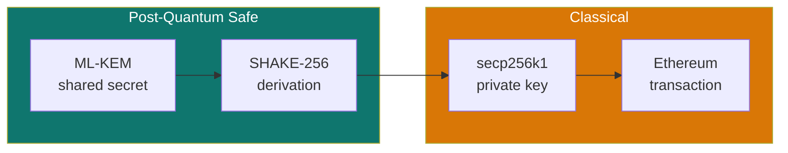
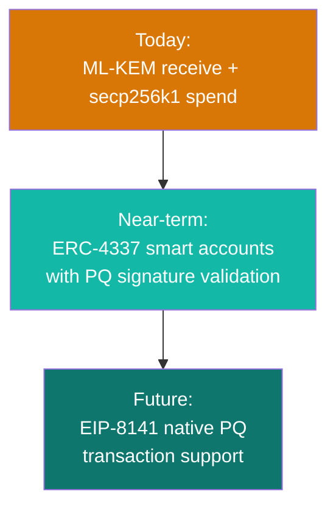

<Frame caption="SPECTER's security model: post-quantum receiving with classical spending compatibility">
  
</Frame>

## The short version

**Receiving is post-quantum. Spending is not. Yet.**

More precisely:

| Layer | Crypto used | Quantum status |
|-------|------------|---------------|
| Recipient discovery (scanning) | ML-KEM-768 | Post-quantum safe |
| Shared secret derivation | ML-KEM-768 | Post-quantum safe |
| View tag computation | SHAKE-256 | Post-quantum safe |
| Stealth address derivation | SHAKE-256 + keccak256 | Post-quantum safe |
| **Spending the funds** | **secp256k1** | **Classical (not PQ)** |

## Why receiving is stronger

When a sender creates a payment, the shared secret comes from ML-KEM encapsulation. The ciphertext published in the announcement is quantum-resistant. A future attacker with a quantum computer cannot:

- Recover the shared secret from the ciphertext
- Determine which recipient the announcement is for
- Link the stealth address back to the meta-address

This is the part that matters most for long-term privacy, because announcement data lives on-chain permanently.

## Where the classical gap is

The wallet-compatible spend path converts the ML-KEM shared secret into a secp256k1 private key. This is a deliberate compatibility choice: existing Ethereum wallets only understand secp256k1 signatures.

What this means in practice:

The **receiving** privacy is quantum-safe. Nobody can determine you received a payment.

The **spending** transaction uses a classical signature. A quantum attacker could theoretically derive the private key from the on-chain public key after you spend. But at that point, the funds are already moved.

## Why this split is acceptable (for now)

The spend-side vulnerability requires:

1. A cryptographically relevant quantum computer (estimated 10-15 years away)
2. Attacking the spending key **after** the stealth address is already known
3. The funds are typically already spent by the time an attacker would try

The receiving-side protection is far more important because:

1. Announcement data is **permanent** and **public**
2. Harvest-now-decrypt-later is a real threat vector
3. Privacy once broken cannot be restored

Protecting the discovery layer with PQ crypto today is the higher-priority defense.

## What could go wrong?

<AccordionGroup>
  <Accordion title="Can an observer link payments to me?">
    Not without your viewing key. The ML-KEM ciphertext in the announcement is quantum-resistant. The stealth address has no mathematical link to your meta-address that an observer can compute.
  </Accordion>
  <Accordion title="Can a quantum attacker break my receiving privacy?">
    Not with any known algorithm. ML-KEM-768 provides NIST Category 3 security (AES-192 equivalent against quantum). No polynomial-time quantum attack on MLWE is known.
  </Accordion>
  <Accordion title="Can a quantum attacker steal my funds?">
    Only if the funds are sitting unspent at a stealth address **and** the public key is exposed on-chain. This is the same risk every Ethereum address faces, not specific to SPECTER. Spending promptly reduces this window.
  </Accordion>
  <Accordion title="What about the secp256k1 spend key?">
    It's classical. If you're concerned about quantum attacks on the spending side, the path forward is smart account wallets (see below). For now, the spend-side risk is the same as any normal Ethereum wallet.
  </Accordion>
</AccordionGroup>

## The path to fully post-quantum spending

### Path 1: ERC-4337 Smart Accounts

[ERC-4337](https://eips.ethereum.org/EIPS/eip-4337) smart accounts can use any signature verification logic. A SPECTER smart account could verify ML-DSA (post-quantum signatures) instead of ECDSA inside `validateUserOp`.

This is the most practical route available today.

### Path 2: EIP-8141 Frame Transactions

[EIP-8141](https://eips.ethereum.org/EIPS/eip-8141) (Draft, January 2026) lets accounts define transaction validity with arbitrary cryptographic systems. Strong long-term fit for native PQ transaction validation.

### Path 3: Hybrid migration

1. Keep ML-KEM for receive/discovery (already done)
2. Route spending through smart-account validation
3. Swap ECDSA verification for a PQ signature scheme when infrastructure is ready

<Frame caption="Green: post-quantum protected. Amber: classical execution compatibility.">
  
</Frame>

<CardGroup cols={2}>
  <Card title="ERC Proposal" icon="scroll" href="/deep-dive/erc-proposal">
    The formal specification for post-quantum stealth addresses on Ethereum.
  </Card>
  <Card title="PQ crypto explainer" icon="atom" href="/deep-dive/post-quantum-explainer">
    What post-quantum cryptography actually means and why it matters.
  </Card>
</CardGroup>
