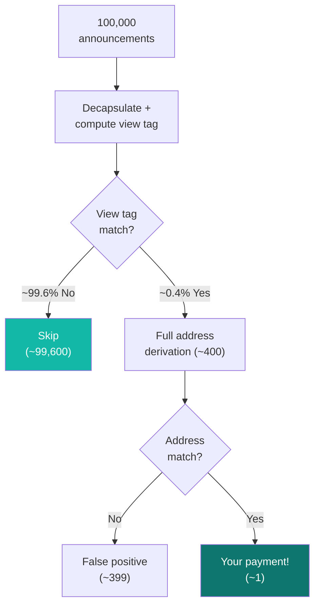

## The scanning problem

Every time someone sends a stealth payment, an announcement gets published. To find payments meant for you, you need to check announcements. But trying to fully process every announcement is expensive: each one requires an ML-KEM decapsulation plus address derivation.

With thousands (or millions) of announcements on-chain, brute-force scanning doesn't scale.

## View tags: the 1-byte shortcut

A view tag is a single byte (value 0-255) derived from the shared secret:

```
view_tag = SHAKE-256("SPECTER_VIEW_TAG" || shared_secret)[0]
```

The sender computes this and includes it in the announcement. When you scan:

1. Decapsulate the ciphertext to get the shared secret
2. Compute your expected view tag from that shared secret
3. Compare it to the announcement's view tag
4. **Mismatch?** Skip immediately. You just saved the expensive address derivation step.

## The math on why this works

There are 256 possible view tag values. For any announcement that isn't yours, the probability of a random match is `1/256 ≈ 0.39%`.

That means **~99.6% of irrelevant announcements are rejected at the view tag step**, before doing any heavy computation.



For 100,000 announcements with one real payment:
- **99,600** are rejected by view tag (cheap)
- **~400** need full derivation (false positive rate)
- **1** is your actual payment

## Scanning performance

SPECTER's Rust-based scanner processes ~100,000 announcements in 1-2 seconds. The view tag optimization is the main reason this is practical.

Compare this to classical systems that take 10-15 seconds for the same volume, and you can see why the combination of ML-KEM + view tags + Rust backend matters for usability.

<Frame caption="Benchmark: SPECTER scanning ~100k announcements with view tag filtering">
  
</Frame>

## How scanning works in the API

```bash
curl -s -X POST https://backend.specterpq.com/api/v1/stealth/scan \
  -H "Content-Type: application/json" \
  -d '{
    "viewing_sk": "<your_viewing_secret_key_hex>",
    "spending_pk": "<your_spending_public_key_hex>",
    "spending_sk": "<your_spending_secret_key_hex>"
  }' | jq .
```

The response returns an array of discovered payments, each with:
- `stealth_address` - the Ethereum address holding funds
- `stealth_sui_address` - the Sui address equivalent
- `eth_private_key` - the derived spending key
- `view_tag` - the matched tag
- Metadata: `tx_hash`, `amount`, `chain`, `channel_id`

## View tags are not encryption

A view tag doesn't hide anything. It's an optimization, not a security feature. Anyone can see the view tag in the announcement. But knowing the view tag without the viewing secret key tells you nothing about who the recipient is.

<CardGroup cols={2}>
  <Card title="Protocol flow" icon="sitemap" href="/how-it-works/protocol-flow">
    See where scanning fits in the full payment process.
  </Card>
  <Card title="Security boundaries" icon="shield" href="/how-it-works/security-boundaries">
    What SPECTER protects and what it doesn't.
  </Card>
</CardGroup>
