<Frame>
  
</Frame>

## Private receiving without a public recipient trail

SPECTER lets you publish one public **meta-address** and receive each payment at a different one-time **stealth address**.

The discovery path uses **ML-KEM-768**, so the announcement data that helps you recover payments is designed to remain private even under future quantum attacks.

<Reveal>
<CardGroup cols={2}>
  <Card title="Understand the model" icon="route-2" href="/why-specter/how-specter-works">
    Learn the core ideas: meta-addresses, announcements, view tags, and stealth addresses.
  </Card>
  <Card title="Build with the SDK" icon="code" href="/sdk/overview">
    Run the full protocol in TypeScript, with the cryptography on the device.
  </Card>
  <Card title="Run the API quickstart" icon="rocket" href="/getting-started/quickstart">
    Execute the flow end to end against the hosted backend in four calls.
  </Card>
  <Card title="Contribute" icon="tools" href="/build/contribution-opportunities">
    Review the open GitHub issues and find the highest-value work.
  </Card>
</CardGroup>
</Reveal>

---

## Use the docs by goal

These docs are organized around reader intent. Start with the path that matches your job.

<Tabs>
  <Tab title="Evaluating SPECTER">
    Read **[The Problem](/why-specter/the-problem)** for the privacy and quantum context, then **[How SPECTER Works](/why-specter/how-specter-works)** for the plain-language model.

    Use **[SPECTER vs Others](/why-specter/specter-vs-others)** and **[Security Boundaries](/how-it-works/security-boundaries)** to evaluate tradeoffs honestly.
  </Tab>
  <Tab title="Builder">
    Working in TypeScript? Start with the **[SDK Quickstart](/sdk/quickstart)** to run the whole protocol locally, then read the **[SDK API Reference](/sdk/api-reference)** and **[Integration Patterns](/sdk/integration)**.

    Prefer calling a service? Use the **[API Quickstart](/getting-started/quickstart)**, the **[Integration Guide](/build/integration-guide)**, and the **[API Overview](/api/introduction)**.

    To run the stack locally, go to **[Installation](/getting-started/installation)** and **[Development Setup](/build/development-setup)**.
  </Tab>
  <Tab title="Contributor">
    Review **[Contribution Opportunities](/build/contribution-opportunities)** first. It maps the current GitHub backlog to repo areas and contributor skill sets.

    Then use **[Contributing](/build/contributing)** for the workflow and **[Verification Matrix](/reference/verification-matrix)** to keep changes source-backed.
  </Tab>
  <Tab title="Deep technical review">
    Go straight to **[Protocol Flow](/how-it-works/protocol-flow)**, **[Architecture](/how-it-works/architecture)**, and **[Post-Quantum Cryptography](/how-it-works/post-quantum-crypto)**.

    For source-backed validation, use **[Verification Matrix](/reference/verification-matrix)** and the product repo on [GitHub](https://github.com/pranshurastogi/SPECTER).
  </Tab>
</Tabs>

---

## Protocol in 30 seconds

One public address in. A different stealth address for every payment out. Step through the three phases:

<FlowExplainer />

The same flow as a single diagram:

```mermaid
flowchart LR
    subgraph Recipient["Recipient setup"]
        A["Generate spending and viewing keys"]
        B["Publish meta-address"]
        A --> B
    end

    subgraph Sender["Sender flow"]
        C["Resolve meta-address"]
        D["Derive one-time stealth address"]
        E["Send funds"]
        F["Publish announcement"]
        C --> D --> E --> F
    end

    subgraph Recovery["Recipient recovery"]
        G["Scan announcements with viewing key"]
        H["Recover stealth key and spend"]
        G --> H
    end

    B --> C
    F --> G

    style A fill:#7c3aed,color:#fff
    style B fill:#7c3aed,color:#fff
    style D fill:#a855f7,color:#fff
    style F fill:#a855f7,color:#fff
    style G fill:#6b21a8,color:#fff
    style H fill:#6b21a8,color:#fff
```

1. The recipient creates a `meta-address` from public spending and viewing keys.
2. The sender derives a one-time stealth address from that `meta-address`.
3. The sender transfers funds and publishes an **announcement** using the server-bound `payment_id`.
4. The recipient scans announcements, recovers the matching stealth key, and spends normally.

Observers can see the transfer and the announcement. They should not be able to link the stealth address back to the recipient without the private keys.

---

## Current implementation status

<Warning>
The docs describe the current shipped behavior, not the end-state vision.
</Warning>

| Area | Current status |
|---|---|
| **Key generation** | The [`@specterpq/sdk`](/sdk/overview) generates ML-KEM-768 keys locally in WebAssembly, so secrets stay on the device. The hosted API also exposes `POST /api/v1/keys/generate`, where the backend generates the keys. |
| **Scanning** | The SDK scans announcements locally with the viewing key. The hosted API offers server-side scanning for backends that own the full flow. |
| **Announcement recovery** | Discovery currently depends on the backend-managed registry. Backend-independent recovery from on-chain announcements is tracked in [issue #16](https://github.com/pranshurastogi/SPECTER/issues/16). |

---

## What makes SPECTER different today

| | SPECTER | Classical stealth (Umbra/Fluidkey) |
|---|---|---|
| **Discovery crypto** | ML-KEM-768 (post-quantum) | ECDH (broken by quantum) |
| **Harvest-now-decrypt-later safe** | Yes | No |
| **View tag scanning** | ~1-2s for 100k announcements | 10-15s |
| **Multi-chain** | Ethereum + Sui | Ethereum only |
| **Name service integration** | ENS + SuiNS | ENS |
| **NIST standard** | FIPS 203 | N/A |

<Tip>
If you only read three pages, start with **[How SPECTER Works](/why-specter/how-specter-works)**, **[Protocol Flow](/how-it-works/protocol-flow)**, and **[Security Boundaries](/how-it-works/security-boundaries)**.
</Tip>

---

## Keep going

<Reveal>
<CardGroup cols={2}>
  <Card title="TypeScript SDK" icon="code" href="/sdk/overview">
    Run the protocol locally in TypeScript, with the cryptography on the device.
  </Card>
  <Card title="API reference" icon="network" href="/api/introduction">
    Browse the full REST surface and endpoint groups.
  </Card>
  <Card title="Verification matrix" icon="flask-2" href="/reference/verification-matrix">
    Validate docs claims against the current source and issue backlog.
  </Card>
  <Card title="Contribution opportunities" icon="tools" href="/build/contribution-opportunities">
    Review the current GitHub issues and contributor paths.
  </Card>
</CardGroup>
</Reveal>
