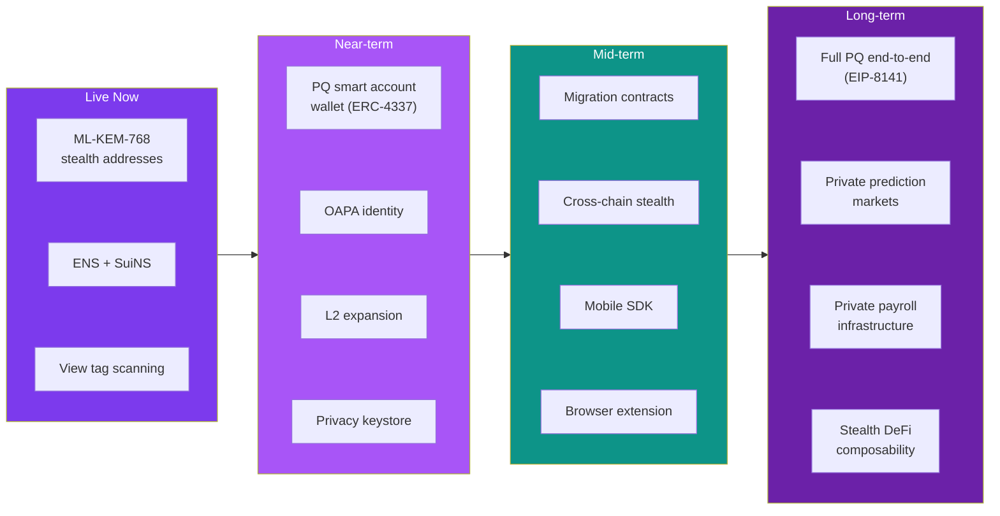

## What's live today

<CardGroup cols={3}>
  <Card title="ML-KEM-768 stealth addresses" icon="shield-lock">
    Post-quantum key generation, stealth payment creation, and announcement scanning.
  </Card>
  <Card title="ENS + SuiNS integration" icon="network">
    Name resolution for human-readable stealth payments on Ethereum and Sui.
  </Card>
</CardGroup>

---

## Near-term: In active development

<Steps>
  <Step title="PQ smart account wallet (ERC-4337)" icon="lock">
    **Priority: High**

    Smart accounts with ML-DSA-65 signature verification inside `validateUserOp`. This closes the classical spending gap by removing the secp256k1 dependency for the spend path.

    The [ERC proposal](/deep-dive/erc-proposal) already specifies deterministic stealth key derivation compatible with ML-DSA-65.
  </Step>
  <Step title="One Address Per Application (OAPA)" icon="shield-lock">
    **Priority: High**

    Deterministic, application-scoped identity derivation from a single master meta-address. Each dApp or service gets its own isolated stealth identity without requiring separate key management.

    Use case: A user has one SPECTER profile but each DeFi protocol, exchange, or service sees a different address.
  </Step>
  <Step title="L2 chain expansion" icon="network">
    **Priority: High**

    Bring stealth addresses to Arbitrum, Base, and Optimism. The same meta-address already derives valid addresses for any EVM chain. The work is in registry support, frontend chain-switching, and gas optimization.
  </Step>
  <Step title="Privacy keystore" icon="lock">
    **Priority: Medium**

    Encrypted keystore system for managing multiple stealth identities with key rotation support. Hardware wallet integration for the master keys.
  </Step>
</Steps>

---

## Mid-term: Research and design phase

<AccordionGroup>
  <Accordion title="Legacy-to-PQ migration contracts" icon="route-2">
    Smart contracts that help existing ERC-5564 schemeId 1 users migrate to schemeId 2 (ML-KEM). The migration path needs to handle re-registration of meta-addresses in the ERC-6538 registry without breaking existing payment channels.
  </Accordion>
  <Accordion title="Cross-chain stealth transfers" icon="network">
    Send from Ethereum, receive privately on Sui (or any supported chain). The ML-KEM shared secret can derive addresses for multiple chains from a single encapsulation. The challenge is bridging the announcement data across chains.
  </Accordion>
  <Accordion title="Mobile SDK" icon="cpu-2">
    Native iOS/Android SDK wrapping the Rust crypto core via FFI. Focus on key management (secure enclave integration), scanning efficiency on mobile networks, and push notifications for discovered payments.
  </Accordion>
  <Accordion title="Browser extension" icon="tools">
    Lightweight extension for stealth address creation and scanning without visiting the full app. Auto-detect ENS names on web pages and offer one-click stealth payments.
  </Accordion>
  <Accordion title="Batch announcement compression" icon="code">
    Reduce on-chain costs by batching multiple announcements into Merkle trees. Recipients prove membership to discover their payment. Could reduce per-announcement gas by 60-80%.
  </Accordion>
</AccordionGroup>

---

## Long-term vision

<Zoomable label="Vision">

</Zoomable>

---

## Feature status tracker

| Feature | Status | Priority | Target |
|---------|--------|----------|--------|
| ML-KEM-768 receive/discover | **Live** | - | - |
| ENS + SuiNS resolution | **Live** | - | - |
| View tag scanning | **Live** | - | - |
| PQ smart account wallet | Research | High | Q2 2026 |
| OAPA identity | Design | High | Q2 2026 |
| Arbitrum / Base / Optimism | Planned | High | Q2 2026 |
| Privacy keystore | Design | Medium | Q3 2026 |
| Migration contracts | Research | High | Q3 2026 |
| Cross-chain stealth | Research | Medium | Q3 2026 |
| Mobile SDK | Planned | Medium | Q4 2026 |
| Browser extension | Planned | Medium | Q4 2026 |
| Full PQ spending (EIP-8141) | Waiting on EIP | High | TBD |

---

## We want your ideas

This roadmap isn't set in stone. If you have ideas for features, use cases, or integrations that would make SPECTER more useful, we'd love to hear from you.

<CardGroup cols={2}>
  <Card title="Suggest a feature" icon="tools" href="https://github.com/pranshurastogi/SPECTER/issues">
    Open a GitHub issue with the `feature-request` label. Describe the use case, not just the feature.
  </Card>
  <Card title="Get in touch" icon="mail-share" href="mailto:pranshurastogi3196@gmail.com">
    Email **pranshurastogi3196@gmail.com** for partnership ideas, research collaboration, or integration questions.
  </Card>
</CardGroup>

Questions about the roadmap? Ideas for new use cases? Follow [@specter_PQ](https://x.com/specter_PQ) for updates, reach out to the creator [@pranshurastogii](https://x.com/pranshurastogii), or open an issue on [GitHub](https://github.com/pranshurastogi/SPECTER/issues).
