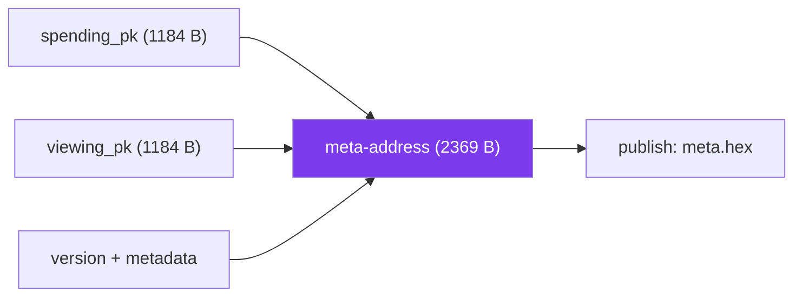

A recipient identity is two ML-KEM-768 keypairs: a **spending** pair and a **viewing** pair. This page explains how they are produced, why the protocol keeps them separate, and how their public halves combine into the one meta-address a recipient shares.

## Two keypairs, two jobs

The split exists so that a recipient can let software watch for payments without giving that software the power to spend.

| Keypair | Public half does | Secret half does | Who needs the secret |
|---------|------------------|------------------|----------------------|
| Spending | Lets a sender derive a stealth address | Recovers the private key that spends | The owner, at spend time |
| Viewing | Lets a sender encapsulate a shared secret | Detects which payments are yours | A scanner, continuously |

A scanning service or a hot device can hold the viewing secret key and still never move funds. The spending secret key can stay in colder storage and only come out to sign. See [security boundaries](/how-it-works/security-boundaries) for why this matters.

## What ML-KEM-768 produces

Each `generateKeysLocal` call runs the ML-KEM-768 key generation algorithm and returns one keypair:

| Part | Size | Notes |
|------|------|-------|
| Public key (encapsulation key) | 1,184 B | Safe to publish |
| Secret key (decapsulation key) | 2,400 B | Never leaves the device |

`generateSpecterKeys` calls this twice and labels the results `spending` and `viewing`. The sizes are fixed by [FIPS 203](https://csrc.nist.gov/pubs/fips/203/final); they are also exported as `KYBER_PUBLIC_KEY_SIZE` and `KYBER_SECRET_KEY_SIZE` so your code never has to hardcode them.

## Where the randomness and the keys live

Key generation needs a good random source, and the secret keys must not leak. SPECTER handles both in the Rust core that the SDK, CLI, and backend all share:

- Keys are generated with the RustCrypto [`ml-kem`](https://github.com/RustCrypto/KEMs) crate, pure Rust with no C dependencies, which is what makes the WebAssembly build possible.
- Every crate enforces `#![forbid(unsafe_code)]`.
- Secret key material is wiped from memory on drop with the `zeroize` crate, so it does not linger after use.

With the [SDK](/sdk/quickstart), this runs on the user's device. The hosted API can also generate keys server side, but then the server sees the secrets. For wallets, generate locally.

```typescript
import { generateSpecterKeys } from '@specterpq/sdk';

const recipient = generateSpecterKeys();
// recipient.spending.publicKey, recipient.spending.secretKey
// recipient.viewing.publicKey,  recipient.viewing.secretKey
```

The secret keys exist on the returned object but are non-enumerable and redacted from logs. See the [SDK security model](/sdk/security).

## From public keys to a meta-address

A recipient never publishes four separate keys. The two public keys are serialized into one **meta-address**, optionally with metadata such as a display name or avatar.

<Zoomable label="Public keys to meta-address">

</Zoomable>

The serialized form is 2,369 bytes: the two 1,184-byte public keys plus a version byte and the metadata structure. The meta-address is the only address a recipient hands out, and it is reusable. Every payment to it still lands at a different stealth address, which is the subject of the [stealth derivation](/under-the-hood/stealth-derivation) page.

```typescript
import { metaAddressFromPublicKeys } from '@specterpq/sdk';

const meta = metaAddressFromPublicKeys(
  recipient.spending.publicKey,
  recipient.viewing.publicKey,
  { description: 'Receive profile' },
);
// meta.hex is publishable; meta.bytes.length === 2369
```

## Recovery implications

These keypairs are long-lived. Treat both secret keys the way you treat a seed phrase:

- Lose the **viewing** secret key and the wallet can no longer detect incoming payments.
- Lose the **spending** secret key and the funds at every stealth address are unrecoverable.

There is no server-side reset. The protocol has no record of the secrets, which is the point.

## Next

- [Shared secret](/under-the-hood/shared-secret): what a sender does with the viewing public key.
- [Security boundaries](/how-it-works/security-boundaries): the trust model behind the key split.
