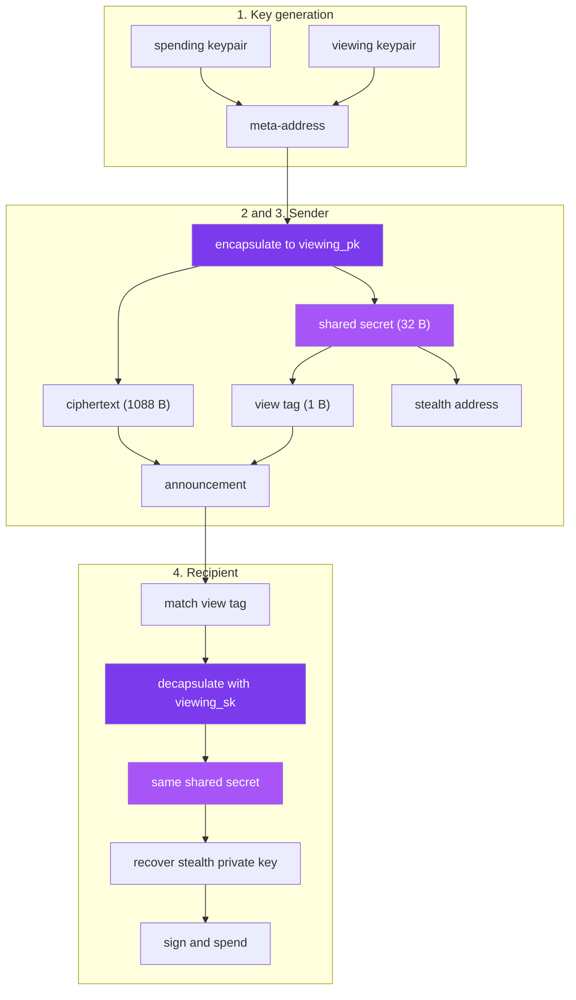

This section is the engineer's view of SPECTER. It follows one payment from the keys that exist before anything happens to the signature that finally moves the funds, and it names the exact primitive at every step.

If you want the plain-language model first, read [How SPECTER works](/why-specter/how-specter-works). If you want to call this from code, read the [SDK reference](/sdk/api-reference). This section sits between the two: it explains what the SDK and the API are actually doing.

## The pipeline at a glance

A payment passes through five cryptographic stages. Each page below takes one stage apart.

<Reveal>
<CardGroup cols={2}>
  <Card title="1. Key generation" icon="lock" href="/under-the-hood/key-generation">
    How the spending and viewing ML-KEM-768 keypairs are produced, and why there are two.
  </Card>
  <Card title="2. Shared secret" icon="cpu-2" href="/under-the-hood/shared-secret">
    Encapsulation and decapsulation: how sender and recipient reach the same 32 bytes.
  </Card>
  <Card title="3. Stealth derivation" icon="route-2" href="/under-the-hood/stealth-derivation">
    Turning the shared secret into a one-time address on Ethereum and Sui.
  </Card>
  <Card title="4. Scanning and spending" icon="dashboard" href="/under-the-hood/scanning-and-spending">
    The view tag filter, the decapsulation check, and recovering the key that signs.
  </Card>
</CardGroup>
</Reveal>

## The objects and their sizes

Every artifact in SPECTER has a fixed size. Knowing them makes the rest of this section concrete.

| Object | Size | Lives | Secret |
|--------|------|-------|--------|
| Spending public key (secp256k1) | 33 B | In the meta-address | No |
| Spending secret key (secp256k1) | 32 B | Recipient device | Yes |
| Viewing public key (ML-KEM-768) | 1,184 B | In the meta-address | No |
| Viewing secret key (ML-KEM-768) | 2,400 B | Recipient device | Yes |
| Meta-address (serialized) | 1,218 B | Published | No |
| Announcement ciphertext | 1,088 B | On-chain or in the registry | No |
| Shared secret | 32 B | Derived on both sides | Yes |
| View tag | 1 B | In the announcement | No |
| Stealth Ethereum address | 20 B | On-chain | No |
| Stealth Sui address | 32 B | On-chain | No |
| Recovered Ethereum private key | 32 B | Recipient device | Yes |

The public key and ciphertext sizes are ML-KEM-768 as standardized in [FIPS 203](https://csrc.nist.gov/pubs/fips/203/final).

## The flow as one diagram



## Two derivations from one secret

Almost everything after encapsulation comes from the 32-byte shared secret, expanded with domain-separated SHAKE-256 so that two different uses of the same secret never collide:

```
view_tag      = SHAKE-256("SPECTER_VIEW_TAG_V1"      || shared_secret)[0]
tweak  t      = H_to_scalar("SPECTER_STEALTH_TWEAK_V2" || shared_secret || counter)
stealth addr  P = spending_pub + t·G     (additive tweak; recipient spends with b + t)
```

The domain strings are the separator, and the version suffix (`_V1` for the view tag, `_V2` for the tweak) versions them so the protocol can revise a derivation without ambiguity — the `_V2` tweak replaced a pre-2.0 hash-only construction that let the sender reconstruct the stealth private key. The same shared secret feeds both, but the prefixes guarantee the view tag tells you nothing about the stealth key. The exact constructions live in the SPECTER Rust core; this section describes what each one produces and why. See [stealth derivation](/under-the-hood/stealth-derivation) for the full tweak construction.

## Related

- [Post-quantum cryptography in SPECTER](/how-it-works/post-quantum-crypto)
- [Protocol flow](/how-it-works/protocol-flow)
- [SDK API reference](/sdk/api-reference)
