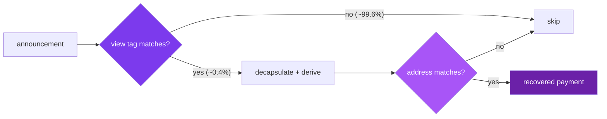
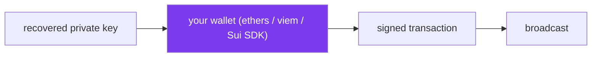

A recipient does not know in advance which announcements are theirs. Scanning is the process of finding out. This page covers the full loop: the cheap view-tag filter, the decapsulation check that confirms a real match, key recovery, and the final spend.

## The cost problem

Every stealth payment publishes an announcement. To find payments meant for you, you have to test announcements against your viewing key. The honest test is a decapsulation followed by a derivation, and that is too expensive to run on every announcement when there are millions of them. The view tag exists to avoid almost all of that work.

## Step 1: the view tag filter

The view tag is one byte derived from the shared secret under its own domain string:

```
view_tag = SHAKE-256("SPECTER_VIEW_TAG" || shared_secret)[0]
```

The sender computes it and includes it in the announcement. When a recipient scans, they reproduce the expected tag from their own decapsulation and compare. A view tag is a filter, not encryption. It carries no key material. Its only job is to let the recipient reject announcements quickly.

There are 256 possible values, so an announcement that is not yours matches your tag by chance with probability 1 in 256, about 0.39 percent. That means roughly 255 of every 256 unrelated announcements are discarded before any expensive work. See [view tags and scanning](/how-it-works/view-tags-and-scanning) for the cost model in full.



## Step 2: confirm by decapsulation

A view-tag match is a candidate, not a certainty. The roughly 1-in-256 false positives have to be rejected. For each candidate, the recipient decapsulates the announcement ciphertext with the viewing secret key, derives the stealth address from the result, and checks it against the announcement. A real payment passes both tests. A false positive fails the address check and is dropped.

The SDK does this for you and tells you which test failed when there is no match:

```typescript
import { scanAnnouncement } from '@specterpq/sdk';

const result = scanAnnouncement(
  { ephemeralCiphertext: announcement.ciphertext, viewTag: announcement.viewTag },
  recipient.viewing,
  recipient.spending.publicKey,
);

if (result.isMatch) {
  result.stealthKeys.ethAddress;
} else {
  result.reason; // 'view_tag_mismatch' | 'address_mismatch'
}
```

For a batch, `scanAnnouncements` runs the same loop over an array and returns one result per announcement.

```typescript
const matches = scanAnnouncements(batch, recipient.viewing, recipient.spending.publicKey)
  .filter((r) => r.isMatch);
```

## Step 3: recover the key

A confirmed match carries the recovered stealth keys, including the private key. This is the same [stealth derivation](/under-the-hood/stealth-derivation) the sender ran for the address, except the recipient takes the full key material out of it.

```typescript
for (const match of matches) {
  const privateKey = match.stealthKeys.ethPrivateKey; // 32 bytes, secret
  // import into your signing path
}
```

<Warning>
The recovered private key spends real funds. Keep it inside the signing path. Do not log it, store it in plaintext, or send it to any service. Local scanning keeps this key on the device; remote scanning sends your viewing secret key to a backend, which is a different trust decision. See the [SDK security model](/sdk/security).
</Warning>

## Step 4: spend

SPECTER stops at the recovered key. It does not sign or broadcast. Spending uses your existing wallet stack with the private key the scan returned:

- On **Ethereum**, the key is a standard secp256k1 private key. Import it into ethers, viem, or any signer and send a normal transaction.
- On **Sui**, the key is an Ed25519 key usable with the Sui SDK.

Because the spend uses a standard signature, the transaction looks ordinary on-chain. The privacy was established at receive time, when the stealth address was derived with no public link to your meta-address. The spend itself is a normal transfer.



## The one classical step

Receiving is post-quantum: the shared secret behind every announcement is protected by [ML-KEM-768](/under-the-hood/shared-secret). The spend signature is classical: secp256k1 on Ethereum, Ed25519 on Sui. A future quantum computer could attack those signatures, but only after the key is used on-chain, by which point the funds have moved. The protocol prioritizes the receiving path because announcement data is permanent and public, while a spend is a one-time event. The full reasoning and the migration path are in [security boundaries](/how-it-works/security-boundaries).

## Next

- [View tags and scanning](/how-it-works/view-tags-and-scanning): the probability and cost model in depth.
- [SDK integration patterns](/sdk/integration): a complete scanner in code.
