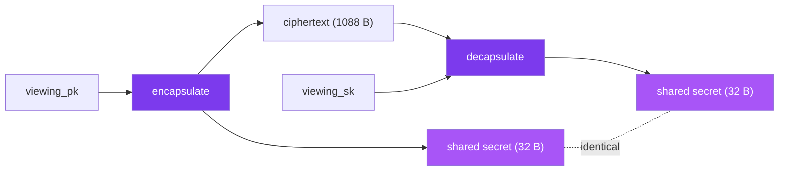

Every private part of a SPECTER payment grows from one 32-byte value: the **shared secret**. This page explains how the sender and the recipient arrive at the exact same 32 bytes, even though they never communicate directly, and why a future quantum computer cannot reproduce them.

## The problem a KEM solves

The sender wants a secret that only the recipient can also compute. The sender has the recipient's viewing public key and nothing else. A key encapsulation mechanism, or KEM, is built for exactly this:

1. The sender runs **encapsulate** on the viewing public key. Out comes a ciphertext and a shared secret.
2. The sender keeps the shared secret and publishes the ciphertext.
3. The recipient runs **decapsulate** on the ciphertext with the viewing secret key and recovers the same shared secret.

No back-and-forth. The sender acts once, the recipient acts later, and both hold the same 32 bytes.



## In code

```typescript
import { encapsulate, decapsulate } from '@specterpq/sdk';

// Sender
const enc = encapsulate(recipient.viewing.publicKey);
enc.ciphertext;    // 1088 bytes, published in the announcement
enc.sharedSecret;  // 32 bytes, secret-bearing

// Recipient
const sharedSecret = decapsulate(enc.ciphertext, recipient.viewing.secretKey);
// equals enc.sharedSecret
```

The ciphertext is `KYBER_CIPHERTEXT_SIZE` (1,088 bytes) and the shared secret is `KYBER_SHARED_SECRET_SIZE` (32 bytes).

## Why a quantum computer cannot recover it

The ciphertext sits in the announcement forever. Anyone can copy it. The security claim is that copying it is not enough.

Classical stealth address schemes derive their shared secret with elliptic-curve Diffie-Hellman. Shor's algorithm solves the elliptic-curve discrete logarithm in polynomial time on a quantum computer, so a stored ECDH ciphertext could be decrypted years later once such a computer exists. This is the harvest-now-decrypt-later threat.

ML-KEM-768 rests on the Module Learning With Errors problem instead. No known quantum algorithm solves it efficiently. The shared secret behind a SPECTER announcement is designed to stay out of reach even for an adversary who stored the ciphertext today and runs a quantum computer tomorrow. See [post-quantum cryptography](/how-it-works/post-quantum-crypto) for the deeper comparison.

<Note>
ML-KEM-768 provides NIST Category 3 security, equivalent to AES-192 against quantum attacks on the KEM. SPECTER uses the 768 parameter set because it balances that margin against key and ciphertext size, which matters when the ciphertext lives on-chain.
</Note>

## What the shared secret is not

The shared secret protects the **discovery** path: it is what lets the right recipient, and only the right recipient, recognize and recover a payment. It does not hide the on-chain transfer amount, the timing, or the network-level metadata of the transaction. Those are out of scope for the KEM and are covered in [security boundaries](/how-it-works/security-boundaries).

## What happens next

The shared secret is never used directly as a key. It is expanded with domain-separated SHAKE-256 into two independent outputs: a one-byte view tag and the material for a stealth address. That expansion is the [stealth derivation](/under-the-hood/stealth-derivation) step.

## Next

- [Stealth derivation](/under-the-hood/stealth-derivation): turning 32 bytes into an address.
- [Scanning and spending](/under-the-hood/scanning-and-spending): how the recipient finds the right ciphertext to decapsulate.
