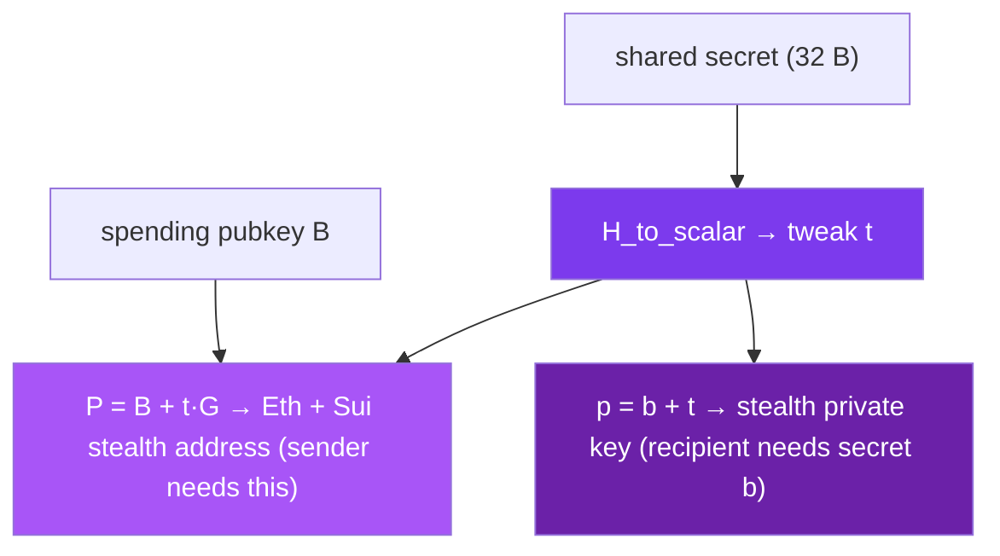

The shared secret is not used as a key directly. It is expanded into the material for a fresh, one-time address, bound to the recipient's spending identity so that only the right recipient can recover the key that spends it. This page follows that expansion to a usable Ethereum and Sui address.

## The tweak step

The derivation starts from two inputs the sender already has: the 32-byte shared secret and the recipient's secp256k1 spending public key `B`. The shared secret is hashed into a secp256k1 scalar — the **tweak** `t` — under a fixed domain string:

```
t = H_to_scalar("SPECTER_STEALTH_TWEAK_V2" || shared_secret || counter)
```

`H_to_scalar` is SHAKE-256 with rejection sampling: it draws 32-byte candidates, incrementing the one-byte `counter` each time, until one lands in the valid range `[1, n)` for the secp256k1 group order `n`. The `"SPECTER_STEALTH_TWEAK_V2"` prefix is the domain separator, so this scalar is independent of the [view tag](/under-the-hood/scanning-and-spending), which is derived from the same shared secret under a different prefix. The `_V2` suffix versions the construction: it replaced the pre-2.0 hash-only derivation, under which the sender could reconstruct the stealth *private* key.

The tweak then shifts the recipient's spending key — an ERC-5564-style additive construction over secp256k1:

```
stealth address   P = B + t·G      (sender computes this from the PUBLIC key B)
stealth private   p = b + t mod n   (recipient computes this with the SECRET key b)
```

Because `p·G = P`, the address the sender funds from public data is exactly the one the recipient can spend. Critically, the sender **cannot** compute `p`: that needs the secret spending scalar `b`, which never leaves the recipient. The exact construction lives in the SPECTER Rust core and is matched byte-for-byte by the SDK. What matters for integration is the inputs, the outputs, and their sizes.

## Ethereum: a secp256k1 address

For Ethereum, the derived material becomes a secp256k1 keypair, and the address is taken from its public key with keccak256, the same hash Ethereum uses everywhere.

| Output | Size | Notes |
|--------|------|-------|
| Stealth private key | 32 B | secp256k1 scalar, recovered by the recipient |
| Stealth public key | 65 B | secp256k1 uncompressed point |
| Stealth address | 20 B | last 20 bytes of `keccak256(public_key)`, shown as `0x...` |

Because the address comes from a standard secp256k1 key, any existing Ethereum wallet, signer, or library can spend from it once the private key is imported. SPECTER does not need a new signature scheme on the spend path. That compatibility is deliberate, and its quantum tradeoff is covered in [security boundaries](/how-it-works/security-boundaries).

## Sui: a secp256k1 address

For Sui, SPECTER reuses the same secp256k1 key it derived for Ethereum. The Sui address is the 32-byte `blake2b-256(0x01 || compressed_public_key)`, where `0x01` is Sui's scheme flag for secp256k1. One encapsulation therefore yields a destination on both chains, both spendable from a single secp256k1 key:

```typescript
import { deriveStealthAddress, deriveStealthSuiAddress } from '@specterpq/sdk';

const eth = deriveStealthAddress(recipient.spending.publicKey, sharedSecret); // 0x + 20 bytes
const sui = deriveStealthSuiAddress(recipient.spending.publicKey, sharedSecret); // 0x + 32 bytes
```

## Two sides, two outputs

The sender and the recipient run derivations from the same inputs, but they need different things from it.

<Zoomable label="Stealth key generation">

</Zoomable>

- The **sender** uses `deriveStealthAddress` (public key only) to get the destination, sends funds there, and is done.
- The **recipient** uses `deriveStealthKeys` with their **secret** spending key to recover the private key that signs. (A watch-only client can call `deriveStealthPublic` to re-derive just the addresses and the stealth public key, without the secret.)

```typescript
import { deriveStealthKeys } from '@specterpq/sdk';

// Needs the recipient's SECRET spending key — only they can run this.
const keys = deriveStealthKeys(recipient.spending.secretKey, sharedSecret);
keys.ethAddress;
keys.suiAddress;
keys.ethPrivateKey;  // secret-bearing, spends the funds
```

<Warning>
`ethPrivateKey` spends real funds. Import it straight into your signing path. Do not log it or copy it into analytics or error reports. The SDK redacts it from JSON and console output, but it cannot stop your own code from leaking a copy.
</Warning>

## Why the address has no public link to the recipient

A sender resolves one meta-address but produces a different stealth address for every payment, because every payment has a different shared secret, and the address is derived from that secret. An observer sees a normal-looking address receive funds. Without the viewing secret key, there is no value they can compute that ties that address back to the meta-address. That gap is the privacy SPECTER provides.

## Next

- [Scanning and spending](/under-the-hood/scanning-and-spending): how the recipient finds which announcements to derive from, and how the spend completes.
- [The shared secret](/under-the-hood/shared-secret): where the 32 bytes came from.
