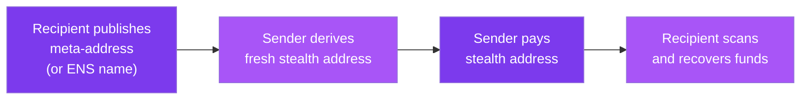

## The core use case

You want to receive payments without revealing your wallet address. Maybe you're a freelancer who doesn't want clients seeing your balance. Maybe you're a DAO contributor who values financial privacy. Maybe you just don't want your entire transaction history attached to one public identifier.

SPECTER makes this work with three steps:

<Zoomable label="Private payments">

</Zoomable>

## Real-world scenarios

<Frame></Frame>

### Freelancer payments

Alice does contract work for three different companies. Without SPECTER, all three pay to `0xAlice`, and each company can see what the others pay her.

With SPECTER, Alice shares her ENS name (`alice.eth`). Each company derives a different stealth address. No company can see payments from the others.

### DAO contributor payroll

A DAO pays 50 contributors monthly. On a public chain, every contributor's compensation is visible to everyone. With SPECTER, each payment goes to a unique stealth address. Contributors get paid privately.

### Donations

A charity accepts crypto donations. Donors want to be anonymous. With SPECTER, each donation goes to a different stealth address. The charity can still receive and track donations, but outside observers can't determine who donated what.

### OTC trades

Two parties want to settle an over-the-counter trade without broadcasting their relationship on-chain. SPECTER stealth addresses keep the counterparty link invisible to observers.

## The payment flow

<Steps>
  <Step title="Recipient sets up" icon="lock">
    Generate ML-KEM keys and publish your meta-address. Link it to your ENS name for easy discovery.
  </Step>
  <Step title="Sender resolves and pays" icon="mail-share">
    The sender resolves your name (or uses your meta-address directly), derives a stealth address, sends payment, and posts an announcement.
  </Step>
  <Step title="Recipient scans" icon="dashboard">
    You periodically scan the announcement registry. View tags filter out 99.6% of irrelevant announcements. When you find a match, you recover the private key for the stealth address.
  </Step>
  <Step title="Recipient spends" icon="lock">
    Import the derived private key into any Ethereum wallet. The funds are yours to spend like any normal transaction.
  </Step>
</Steps>

## Multi-chain support

The same meta-address produces valid stealth addresses on both Ethereum and Sui. The API returns both:

```json
{
  "payment_id": "00000000-0000-0000-0000-000000000000",
  "stealth_address": "0x...",
  "stealth_sui_address": "0x...",
  "ephemeral_ciphertext": "...",
  "view_tag": 42
}
```

Arbitrum, Base, and Optimism support is on the roadmap.

## Name service integration

Senders don't need to handle raw hex meta-addresses. SPECTER integrates with:

- **ENS** (.eth names) on Ethereum
- **SuiNS** (.sui names) on Sui

Read [Name Services](/use-cases/name-services) for setup details.

<CardGroup cols={2}>
  <Card title="Try it now" icon="rocket" href="/explore/playground">
    Run the full payment flow against the live API.
  </Card>
  <Card title="Name services" icon="network" href="/use-cases/name-services">
    Send privately with ENS and SuiNS names.
  </Card>
</CardGroup>
