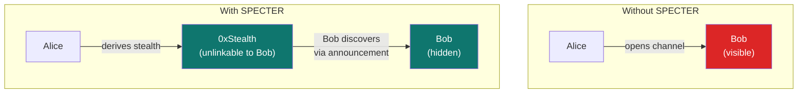

<Frame caption="Yellow + SPECTER: Private trading channels where counterparty identity stays hidden">
  
</Frame>

## Private payments meet private trading

Stealth addresses are useful for one-time payments. But they become much more powerful when you attach them to ongoing financial relationships.

Yellow Network runs state channels for off-chain trading. SPECTER makes those channels private: the counterparty relationship is hidden behind stealth addresses.

## The problem Yellow solves

Without SPECTER:
- Alice opens a channel with Bob
- On-chain observers see Alice and Bob are connected
- Trading patterns between them are visible

With SPECTER + Yellow:
- Alice resolves Bob's meta-address
- Alice derives a stealth address for Bob
- The channel is opened to that stealth address
- Bob discovers the channel through SPECTER's announcement system
- Observers see a channel to an unknown address



## How it works

<Steps>
  <Step title="Alice initiates" icon="user-plus">
    Alice enters Bob's ENS name or meta-address and chooses a token/amount.
  </Step>
  <Step title="SPECTER creates a private destination" icon="shield">
    The backend derives a stealth address for Bob and creates an announcement with a `channel_id` linking it to the Yellow channel.
  </Step>
  <Step title="Channel opens to stealth address" icon="link">
    The Yellow channel is bound to the stealth address instead of Bob's public identity.
  </Step>
  <Step title="Bob discovers the channel" icon="radar">
    Bob scans announcements with his SPECTER keys and finds the channel-linked discovery. He now has the stealth private key and the channel metadata.
  </Step>
  <Step title="Off-chain trading" icon="chart-line">
    Alice and Bob trade off-chain through the state channel. Settlement goes to the stealth address.
  </Step>
</Steps>

<Frame caption="The complete Yellow channel lifecycle with SPECTER stealth addresses">
  
</Frame>

## API flow

### Create a channel

```bash
curl -s -X POST https://backend.specterpq.com/api/v1/yellow/channel/create \
  -H "Content-Type: application/json" \
  -d '{
    "recipient": "bob.eth",
    "token": "USDC",
    "amount": "1000"
  }' | jq .
```

### Discover incoming channels

```bash
curl -s -X POST https://backend.specterpq.com/api/v1/yellow/channel/discover \
  -H "Content-Type: application/json" \
  -d '{
    "viewing_sk": "<HEX>",
    "spending_pk": "<HEX>",
    "spending_sk": "<HEX>"
  }' | jq .
```

### Full endpoint table

| Endpoint | Status | What it does |
|----------|--------|-------------|
| `POST /yellow/channel/create` | Live | Derives stealth address, creates announcement with `channel_id` |
| `POST /yellow/channel/discover` | Live | Scans for channel-linked announcements |
| `GET /yellow/config` | Live | Returns WebSocket and contract configuration |
| `POST /yellow/channel/fund` | Scaffold | API shape exists, simplified response |
| `POST /yellow/channel/close` | Scaffold | Returns placeholder close output |
| `GET /yellow/channel/:id/status` | Live | Channel status lookup |

<Warning>
The fund and close endpoints currently return placeholder-style fields. They demonstrate the integration surface but don't submit real L1 settlement transactions. Treat them as integration scaffolding.
</Warning>

## Why this matters

Most privacy protocols stop at payments. SPECTER extends privacy into ongoing financial relationships. Stealth addresses aren't just a one-time trick. They're a coordination primitive that can hide counterparty identity in channels, recurring payments, and multi-party setups.

Yellow is the first integration that demonstrates this, with real API endpoints you can test today.

<CardGroup cols={2}>
  <Card title="Yellow API docs" icon="code" href="/api/yellow">
    Full endpoint documentation with request/response examples.
  </Card>
  <Card title="Try Yellow in the app" icon="rocket" href="https://specterpq.com/yellow">
    Use the hosted Yellow page.
  </Card>
</CardGroup>
