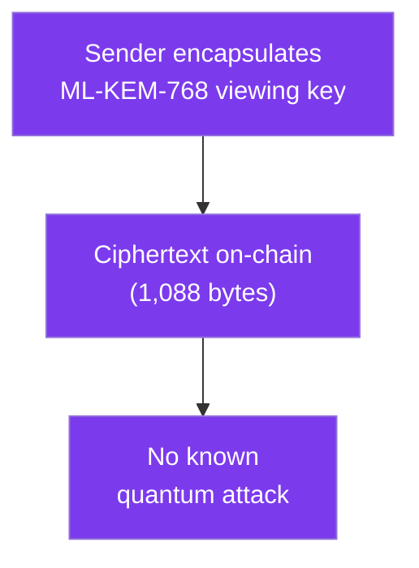
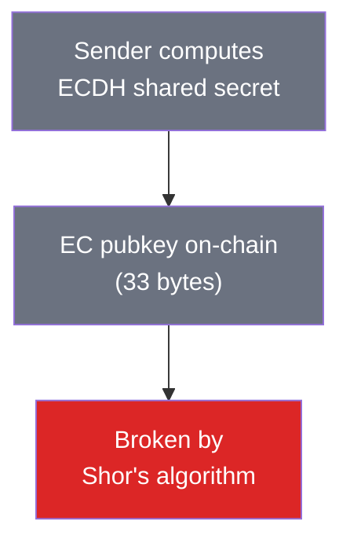

## The landscape

Stealth addresses aren't new. [ERC-5564](https://eips.ethereum.org/EIPS/eip-5564) standardized them for Ethereum, and projects like Umbra and Fluidkey have working implementations.

SPECTER's contribution is replacing the classical cryptographic foundation with a post-quantum one, while keeping everything else compatible.

## Head-to-head comparison

| Feature | SPECTER | Umbra | Fluidkey |
|---------|---------|-------|----------|
| **Key exchange** | ML-KEM-768 (FIPS 203) | ECDH (secp256k1) | ECDH (secp256k1) |
| **Quantum resistant** | Discovery layer: yes | No | No |
| **Harvest-now-decrypt-later safe** | Yes | No | No |
| **NIST standardized crypto** | Yes (FIPS 203) | No (pre-standard curves) | No |
| **View tag optimization** | 1 byte, ~99.6% skip rate | 1 byte | 1 byte |
| **Scan speed (100k announcements)** | ~1-2 seconds | ~10-15 seconds | N/A |
| **Chains supported** | Ethereum, Arbitrum, Monad, Sui | Ethereum | Ethereum |
| **Name service support** | ENS + SuiNS | ENS | ENS |
| **ERC-5564 compatible** | Yes (schemeId 2) | Yes (schemeId 1) | Partial |
| **Spend path** | secp256k1 (classical) | secp256k1 (classical) | secp256k1 (classical) |
| **Open source** | Yes | Yes | Partial |

## What SPECTER does differently

### Post-quantum discovery

The biggest difference is in the cryptographic primitive used for the sender-recipient shared secret. SPECTER uses ML-KEM-768 instead of ECDH.

This means the announcement ciphertexts stored on-chain are protected against quantum attacks. A future attacker with a quantum computer can't retroactively break the privacy of old payments.

<strong>SPECTER</strong>

**Classical (Umbra / Fluidkey)**

### Faster scanning

SPECTER's Rust-based scanner processes announcements faster than JavaScript-based alternatives. View tags provide the same 256x speedup, but the backend implementation is more efficient.

### Multi-chain from day one

Stealth addresses derived by SPECTER work across the EVM chains (Ethereum, Arbitrum, and Monad) and Sui. The same ML-KEM shared secret produces a valid EVM address and a valid Sui address.

## What's the same

All stealth address systems share the same fundamental approach: one-time addresses derived from a public profile, with announcements that let the recipient find their payments. SPECTER doesn't reinvent that wheel. It upgrades the crypto underneath.

The spend path is also the same across all current systems: the resulting wallet key is still secp256k1 for Ethereum. That's an ecosystem limitation, not a SPECTER-specific one. See [Security Boundaries](/how-it-works/security-boundaries) for the full picture.

## Key size tradeoffs

ML-KEM-768 keys are larger than elliptic curve keys:

| | ML-KEM-768 (SPECTER) | secp256k1 (Classical) |
|---|---|---|
| Public key | 1,184 bytes | 33 bytes |
| Secret key | 2,400 bytes | 32 bytes |
| Ciphertext | 1,088 bytes | 33 bytes |
| Shared secret | 32 bytes | 32 bytes |

The tradeoff: larger keys and ciphertexts in exchange for quantum resistance. The shared secret output is the same size, so downstream operations (address derivation, view tags) are unaffected.

For on-chain announcements, the 1,088-byte ciphertext costs more gas than a 33-byte EC public key. This is a real cost, but it's the price of quantum safety for permanent on-chain data.

<CardGroup cols={2}>
  <Card title="See the protocol flow" icon="route-2" href="/how-it-works/protocol-flow">
    How the full payment process works, step by step.
  </Card>
  <Card title="PQ crypto deep dive" icon="circuit-resistor" href="/deep-dive/post-quantum-explainer">
    What ML-KEM actually does and why it resists quantum attacks.
  </Card>
</CardGroup>
