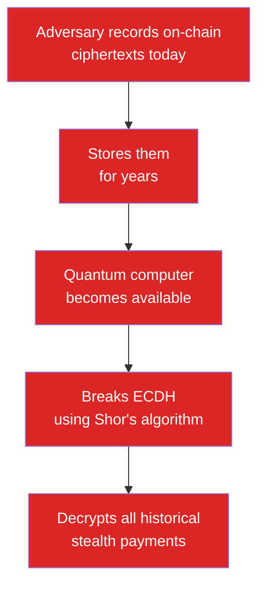

## Your Ethereum address is a glass wallet

When you share your address to receive a payment, you're handing over your entire financial history. Your employer pays you? Now they know every token you hold, every DeFi position, every NFT purchase. A friend sends you ETH? They can see your whole balance sheet.

This isn't a theoretical problem. On-chain tracking tools make it trivial. And $3.8 billion was stolen in 2023 partly because attackers could trace and profile wallets.

The core issue: **on public blockchains, your address is your identity.** Once it's known, everything connected to it is visible forever.

## The two problems SPECTER solves

### Problem 1: Receiving payments destroys privacy

Every existing stealth address system (Umbra, Fluidkey) uses classical elliptic curve cryptography (ECDH) for the privacy layer. That works against today's computers.

But stealth systems leave cryptographic data on-chain permanently: ciphertexts, public keys, announcements. This data can't be deleted.

### Problem 2: Quantum computers will break classical crypto

This is the harvest-now-decrypt-later attack:

An attacker doesn't need a quantum computer today. They just need to save the data. When quantum computers are powerful enough (NIST estimates 10-15 years), they can retroactively break the privacy of every classical stealth payment ever made.

For a protocol where privacy is the whole point, that's a death sentence.

## Why this matters right now

You might think "quantum computers are far away." But consider:

- **Privacy data is permanent.** On-chain ciphertexts don't expire. A payment you receive today could be deanonymized in 2035.
- **Nation-state adversaries are already stockpiling.** Intelligence agencies are collecting encrypted data now for future decryption.
- **NIST has already finalized post-quantum standards.** ML-KEM (FIPS 203) was standardized in August 2024. The cryptography community isn't waiting.
- **Migration takes years.** The longer we wait to adopt PQ crypto, the bigger the window of vulnerable data.

## What's needed

A stealth address system that:

1. Gives every sender a fresh, unlinkable destination for the recipient
2. Uses post-quantum cryptography for the discovery layer so on-chain data stays private forever
3. Works with existing wallets and chains without consensus changes
4. Is fast enough to actually use (scanning thousands of announcements in seconds)

That's what SPECTER builds.

<CardGroup cols={2}>
  <Card title="How SPECTER solves this" icon="shield" href="/why-specter/how-specter-works">
    The plain-language explanation of what SPECTER does.
  </Card>
  <Card title="SPECTER vs others" icon="scale-balanced" href="/why-specter/specter-vs-others">
    Side-by-side comparison with Umbra and Fluidkey.
  </Card>
</CardGroup>
