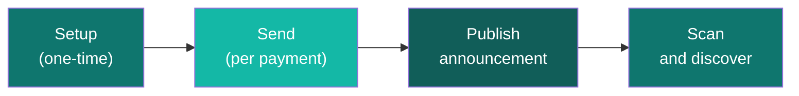

<CardGroup cols={3}>
  <Card title="Launch App" icon="rocket" href="https://specter-stealth.vercel.app/">
    Open the live product and follow along.
  </Card>
  <Card title="API Docs" icon="code" href="/api/introduction">
    Dive into endpoints when you're ready to integrate.
  </Card>
  <Card title="CLI Reference" icon="terminal" href="/reference/cli">
    Run scripted local flows for testing and validation.
  </Card>
</CardGroup>

---

## What You'll Discover

This page walks you through the **live hosted app** — no local setup needed. By the end, you'll understand exactly what users experience and where to integrate programmatically.

---

## Frontend Tour — Step by Step

<Steps>
  <Step title="Setup — Generate Your Identity" icon="key">
    Open **[specter-stealth.vercel.app/setup](https://specter-stealth.vercel.app/setup)** and generate your recipient identity. The app creates your **meta-address** — a public profile containing your spending and viewing public keys.

    Your meta-address is uploaded to IPFS and linked to your ENS or SuiNS name so senders can find you by name.

    

    > This is a one-time action. Your meta-address is what senders need to create private payments for you.
  </Step>
  <Step title="Send — Create a Stealth Payment" icon="paper-plane">
    Open **[specter-stealth.vercel.app/send](https://specter-stealth.vercel.app/send)**. Enter the recipient's ENS/SuiNS name (or paste their meta-address directly). The app creates a **one-time stealth address** — a fresh destination that only the recipient can discover.

    

    > Behind the scenes: `POST /api/v1/stealth/create` — this is the exact endpoint you'll call when integrating.
  </Step>
  <Step title="Scan — Discover Your Payments" icon="magnifying-glass">
    Open **[specter-stealth.vercel.app/scan](https://specter-stealth.vercel.app/scan)**. The app scans all announcements using your private viewing key and reveals only the payments meant for you. View tags filter out ~99.6% of irrelevant entries before decapsulation, keeping scanning very fast.

    

    > Behind the scenes: `POST /api/v1/stealth/scan` — recipients call this to discover their payments.
  </Step>
</Steps>

---

## Choose Your Integration Handoff

<Tabs>
  <Tab title="Frontend Only">
    **Best for**: Product designers, QA onboarding, first-time contributors.

    Stay fully in the hosted app to understand the user journey and expected outputs. No coding required — just explore, click through, and learn the flow.
  </Tab>
  <Tab title="Frontend + API">
    **Best for**: dApp backend teams, wallet integrations, multi-user services.

    Use the frontend for UX understanding, then call the API from your backend for deterministic workflow control. Key endpoints:
    - `POST /api/v1/keys/generate` — generate recipient keys
    - `POST /api/v1/stealth/create` — create stealth payment
    - `POST /api/v1/registry/announcements` — publish announcement
    - `POST /api/v1/stealth/scan` — discover payments

    → **[Full API docs](/api/introduction)**
  </Tab>
  <Tab title="Full Stack">
    **Best for**: DevRel demos, CI smoke checks, support playbooks.

    Use CLI for scripted local validation and the API for production integration. The CLI supports `generate`, `resolve`, `create`, `scan`, `serve`, and `bench` commands.

    → **[CLI reference](/reference/cli)**
  </Tab>
</Tabs>

---

## Product Flow Map

---

## Quick Reference

| Frontend Action | URL | API Endpoint |
| --- | --- | --- |
| Setup keys | [/setup](https://specter-stealth.vercel.app/setup) | `POST /api/v1/keys/generate` |
| Send payment | [/send](https://specter-stealth.vercel.app/send) | `POST /api/v1/stealth/create` |
| Publish | — | `POST /api/v1/registry/announcements` |
| Scan | [/scan](https://specter-stealth.vercel.app/scan) | `POST /api/v1/stealth/scan` |
| Resolve ENS | — | `GET /api/v1/ens/resolve/:name` |

<Info>
This page is product-first on purpose. Stay in frontend mode to understand the experience, then adopt API/CLI only when you need automation.
</Info>
