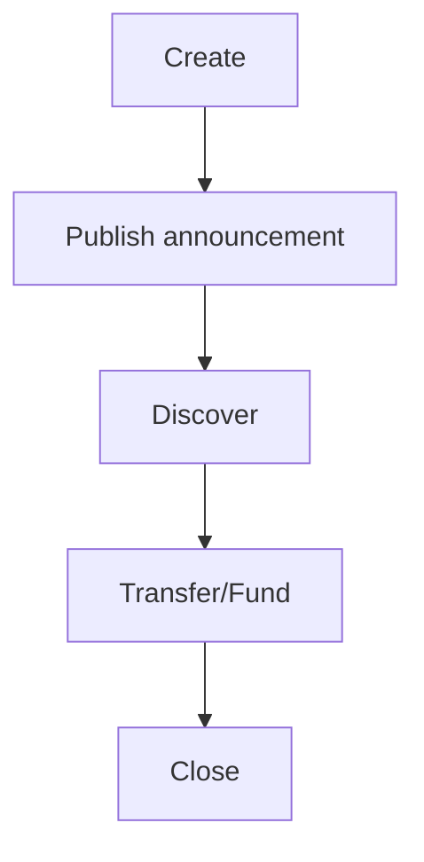

<CardGroup cols={3}>
  <Card title="Hosted app" icon="rocket" href="https://specterpq.com/">
    Run Setup, Send, Scan, and Yellow flows in your browser.
  </Card>
  <Card title="Use cases" icon="map" href="/guides/use-cases-and-yellow-integration">
    Start from live use cases and then test endpoint contracts.
  </Card>
  <Card title="Yellow API" icon="code" href="/api/yellow">
    Use channel endpoints directly against your local backend.
  </Card>
</CardGroup>

## Quick launch links

- App (primary): [https://specterpq.com](https://specterpq.com)
- App (mirror): [https://specterpq.info](https://specterpq.info)
- Yellow page: [https://specterpq.com/yellow](https://specterpq.com/yellow)

## Local API playground

Use `http://localhost:3001` as the default base URL.

<Tabs>
  <Tab title="1) Generate keys">

```bash
curl -s -X POST http://localhost:3001/api/v1/keys/generate | jq .
```

  </Tab>
  <Tab title="2) Create stealth payment">

```bash
curl -s -X POST http://localhost:3001/api/v1/stealth/create \
  -H "Content-Type: application/json" \
  -d '{
    "recipient":"<meta_address_hex>",
    "amount":"100",
    "asset":"ETH"
  }' | jq .
```

  </Tab>
  <Tab title="3) Publish announcement">

```bash
curl -s -X POST http://localhost:3001/api/v1/registry/announcements \
  -H "Content-Type: application/json" \
  -d '{
    "ephemeral_key":"<hex>",
    "view_tag":123,
    "metadata":"demo payment"
  }' | jq .
```

  </Tab>
  <Tab title="4) Scan announcements">

```bash
curl -s -X POST http://localhost:3001/api/v1/stealth/scan \
  -H "Content-Type: application/json" \
  -d '{
    "viewing_sk":"<hex>",
    "spending_pk":"<hex>",
    "spending_sk":"<hex>"
  }' | jq .
```

  </Tab>
</Tabs>

## Yellow playground path

<Steps>
  <Step title="Create private channel" icon="plus">
    Call `POST /api/v1/yellow/channel/create` with recipient, token, and amount.
  </Step>
  <Step title="Discover with recipient keys" icon="radar">
    Call `POST /api/v1/yellow/channel/discover` and verify discovered channel rows.
  </Step>
  <Step title="Inspect config and channel state" icon="gear">
    Call `GET /api/v1/yellow/config` and `GET /api/v1/yellow/channel/:id/status`.
  </Step>
</Steps>



<Warning>
`/yellow/channel/fund` and `/yellow/channel/close` currently return placeholder tx values from backend handlers.
</Warning>
