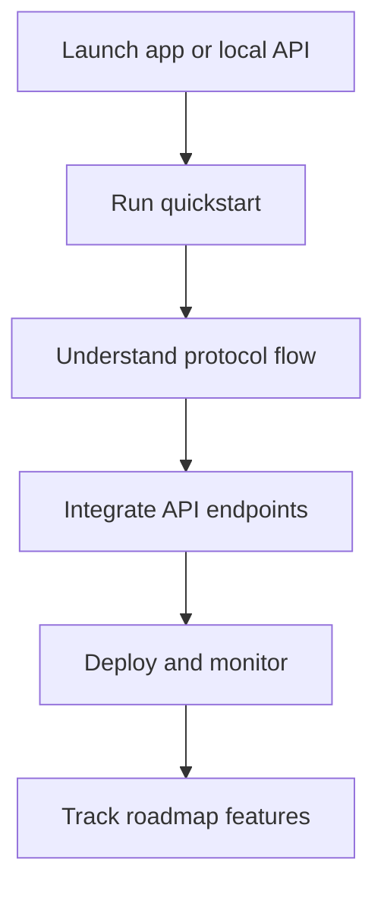

## Launch app first

<CardGroup cols={2}>
  <Card title="Launch SPECTER app" icon="rocket" href="https://specter-stealth.vercel.app/">
    Open the hosted app and try the real flow immediately.
  </Card>
  <Card title="Run local backend" icon="terminal" href="/getting-started/installation">
    Start your own API node and test with curl/CLI.
  </Card>
</CardGroup>

## Pick your role

<CardGroup cols={2}>
  <Card title="I am integrating APIs" icon="code" href="/api/introduction">
    Start with endpoints, payloads, and error handling.
  </Card>
  <Card title="I am building product flows" icon="globe" href="/guides/private-payment-workflow">
    Follow send/receive workflows and UX integration patterns.
  </Card>
  <Card title="I am auditing protocol design" icon="shield-halved" href="/core-concepts/cryptography">
    Review crypto assumptions, constants, and derivation logic.
  </Card>
  <Card title="I am operating infra" icon="server" href="/deployment/production-checklist">
    Use deployment, security, and troubleshooting checklists.
  </Card>
</CardGroup>

## Learning map

<strong>Need the fastest path (under 15 minutes)?</strong>

1. Open the hosted app.
2. Run `/getting-started/quickstart` with `curl`.
3. Validate `POST /api/v1/stealth/create` and `POST /api/v1/stealth/scan`.
4. Save this page and continue from your role card above.

## Source references

- `../SPECTER/README.md`
- `../SPECTER/specter/specter-api/src/routes.rs`
- `../SPECTER/specter/specter-cli/src/main.rs`
