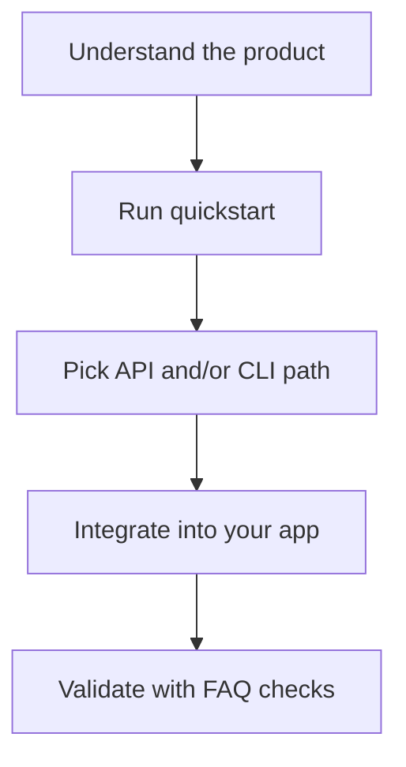

<CardGroup cols={2}>
  <Card title="I Am New to SPECTER" icon="sparkles" href="/getting-started/first-time-overview">
    Start with plain-language walkthrough, analogy, and diagrams.
  </Card>
  <Card title="I Want Product Context First" icon="globe" href="/explore/frontend-experience">
    Learn the user journey in the frontend before coding.
  </Card>
  <Card title="I Am Integrating APIs" icon="code" href="/api/introduction">
    Go endpoint-by-endpoint with request/response schemas.
  </Card>
  <Card title="I Need Guided Integration" icon="map" href="/guides/integration-playbook">
    Follow practical patterns for wallet and app integration.
  </Card>
</CardGroup>

## Learning map

<AccordionGroup>
  <Accordion title="Fastest beginner route (10-15 minutes)">

1. Open `/getting-started/first-time-overview`.
2. Open `/explore/frontend-experience` and launch app.
3. Run `/getting-started/quickstart`.
4. Keep `/faq` open for validation and common fixes.

  </Accordion>
  <Accordion title="Integrator route (backend teams)">

1. Read `/api/introduction`.
2. Run `/getting-started/quickstart`.
3. Use `/guides/integration-playbook` for production integration pattern.
4. Use `/api/registry` and `/api/stealth` as the main loop.

  </Accordion>
</AccordionGroup>
