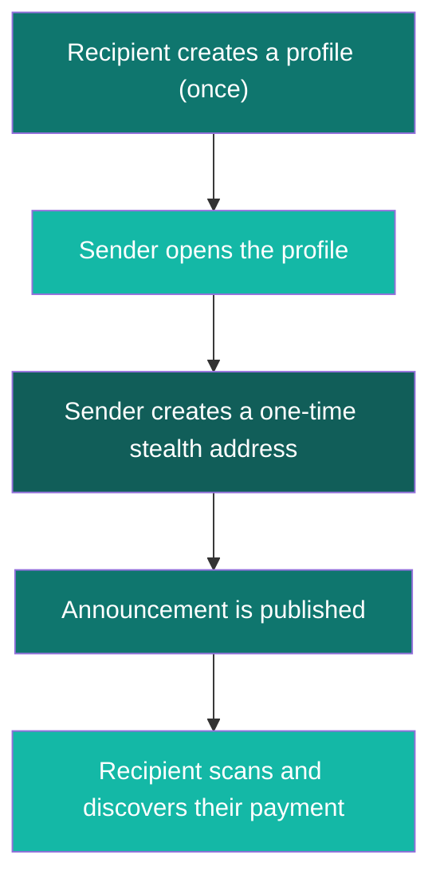
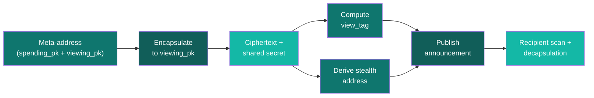

<CardGroup cols={3}>
  <Card title="Launch App" icon="rocket" href="https://specter-stealth.vercel.app/">
    Try the full experience right now — zero setup.
  </Card>
  <Card title="Integration Quickstart" icon="bolt" href="/getting-started/quickstart">
    Run your first integration loop in minutes.
  </Card>
  <Card title="Explore the Product" icon="globe" href="/explore/frontend-experience">
    Take a visual tour of what users see.
  </Card>
</CardGroup>

---

## The Problem We Solve

Every blockchain transaction is public. When someone sends you money, anyone can trace that payment back to your identity, see your balance, and track your activity.

**SPECTER makes payments private.** It gives every recipient a way to receive funds at unique, one-time addresses that cannot be linked back to their main wallet — even by someone watching every transaction on the chain.

And it does this with **post-quantum cryptography** (ML-KEM-768), meaning your privacy stays safe even when quantum computers arrive.

---

## The Analogy — Think "Secure Mail Concierge"

Imagine you live in an apartment building:

<Steps>
  <Step title="You share your building address" icon="building">
    You give out your building's public address — anyone can send you packages. This is your **meta-address** (public profile).
  </Step>
  <Step title="Every package goes to a fresh locker" icon="lock">
    Instead of delivering to your door, each package gets its own **brand-new private locker**. This is the **stealth address** — unique for every payment.
  </Step>
  <Step title="A delivery notice is posted" icon="bell">
    The concierge posts a coded notice on the board. This is the **announcement** — it's public, but only you can decode which locker is yours.
  </Step>
  <Step title="Only you can find your lockers" icon="key">
    You have a special **viewing key** that lets you scan all the notices and figure out which lockers belong to you. No one else can.
  </Step>
</Steps>

<Tip>
Replace "packages" with crypto payments and "lockers" with blockchain addresses — that's SPECTER in a nutshell.
</Tip>

---

## How It Works — The 4-Step Flow

| Step | What happens | Who does it |
| --- | --- | --- |
| **1. Profile** | Recipient generates a public meta-address (spending key + viewing key) | Recipient |
| **2. Create** | Sender uses the meta-address to derive a fresh one-time stealth address | Sender |
| **3. Publish** | Sender publishes an announcement so recipient can find their payment | Sender |
| **4. Scan** | Recipient scans announcements with their private viewing key | Recipient |

---

## What We Built — Three Layers

<CardGroup cols={3}>
  <Card title="Intro Layer" icon="sparkles">
    **The idea**: Private one-time receiving addresses that break the link between sender and recipient.
  </Card>
  <Card title="Product Layer" icon="globe">
    **The app**: A full frontend for key generation, stealth payment creation, publishing, and scanning — [try it live](https://specter-stealth.vercel.app/).
  </Card>
  <Card title="Tech Layer" icon="shield-halved">
    **The crypto**: ML-KEM-768 (post-quantum) + view tags for fast filtering + announcement registry.
  </Card>
</CardGroup>

---

## Under the Hood — For the Curious

<AccordionGroup>
  <Accordion title="What is ML-KEM-768?">
    ML-KEM-768 is a **NIST-standardized post-quantum key encapsulation mechanism** (FIPS 203). It lets two parties establish a shared secret even if an attacker has a quantum computer. SPECTER uses the [`ml-kem`](https://crates.io/crates/ml-kem) crate for all encapsulation and decapsulation operations.

    - **Public key size**: 1184 bytes
    - **Ciphertext size**: 1088 bytes  
    - **Shared secret**: 32 bytes

    This replaces the traditional elliptic curve Diffie-Hellman used in classical stealth address protocols.
  </Accordion>
  <Accordion title="What are view tags?">
    A **view tag** is a 1-byte fingerprint computed from the shared secret. When the recipient scans announcements, they first check the view tag — if it doesn't match, they skip the expensive decapsulation step. This makes scanning **~256× faster** on average.
  </Accordion>
  <Accordion title="How does the announcement registry work?">
    When a sender creates a stealth payment, they publish an **announcement** containing the ephemeral ciphertext and view tag. The recipient periodically scans these announcements using their viewing secret key. The registry can be in-memory (for testing) or file-based (for persistence).
  </Accordion>
  <Accordion title="What chains does SPECTER support?">
    Currently, SPECTER supports **Ethereum** and **Sui** chains. It uses ENS for Ethereum name resolution and SuiNS for Sui name resolution. The core cryptography is chain-agnostic — only the name resolution and on-chain settlement differ.
  </Accordion>
</AccordionGroup>

---

## Technical Flow — How the Crypto Maps

---

## What's Next?

<CardGroup cols={2}>
  <Card title="Explore the Product" icon="globe" href="/explore/frontend-experience">
    Take a visual tour of the hosted app and see every step in action.
  </Card>
  <Card title="Integration Quickstart" icon="bolt" href="/getting-started/quickstart">
    Run the full keygen → create → publish → scan loop with copy-paste commands.
  </Card>
  <Card title="Core Concepts" icon="book-open" href="/core-concepts/architecture">
    Dive deeper into architecture, protocol flow, and cryptography.
  </Card>
  <Card title="FAQ" icon="circle-question" href="/faq">
    Get answers to common beginner and integration questions.
  </Card>
</CardGroup>

<Info>
You don't need to understand the cryptography to use SPECTER. Start with the product tour, then integrate — the crypto details are always here when you're ready.
</Info>
