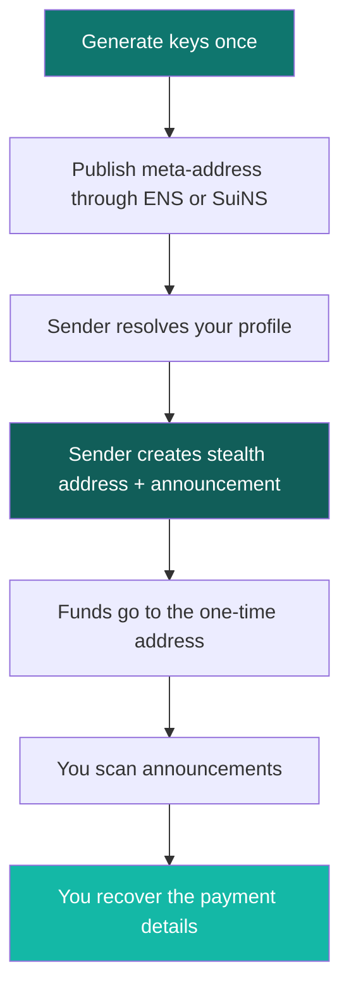

## Start with the human version

SPECTER is not a chain.

It is not a token.

It is not a new wallet standard you have to memorize before using it.

SPECTER is a **private receiving system**.

You publish one public profile, and each sender turns that profile into a different one-time receiving address.

To everyone else, the payment lands at an address that looks unrelated to you.

## If you are new to this space

### What is a stealth address?

A stealth address is a one-time destination created for a single payment.

You do not reuse it.

You do not hand it out in advance.

The sender derives it from your public **meta-address**, and you later recover it by scanning announcements.

### What is a meta-address?

A meta-address is SPECTER's public receiving profile.

It bundles:

- `spending_pk`
- `viewing_pk`

In the current backend, both come from ML-KEM key generation in `specter/specter-api/src/handlers.rs`.

### What is an announcement?

An announcement is the public breadcrumb that lets you find your payment later.

The current wire format includes:

- `ephemeral_key` as the ML-KEM ciphertext
- `view_tag` as a 1-byte scan filter
- optional `channel_id`, `tx_hash`, `amount`, and `chain`

That structure is defined in `specter/specter-core/src/types/announcement.rs`.

## Think of it like this

<Steps>
  <Step title="You publish a mailbox blueprint" icon="mail">
    Your meta-address is not a wallet you receive into directly. It is a public instruction set that lets someone create a one-time mailbox for you.
  </Step>
  <Step title="The sender creates a fresh mailbox" icon="sparkles">
    They use your public data to derive a new stealth address that has not appeared before.
  </Step>
  <Step title="They leave a coded note" icon="bell">
    The announcement tells you that something is waiting, but not in a way outsiders can decode into your identity.
  </Step>
  <Step title="You scan and recover the payment" icon="radar">
    Your viewing secret key lets you find which announcement is yours and recover the spendable result.
  </Step>
</Steps>

## The real product flow

```mermaid
flowchart TD
    A["Generate keys once"] --> B["Publish meta-address through ENS or SuiNS"]
    B --> C["Sender resolves your profile"]
    C --> D["Sender creates stealth address + announcement"]
    D --> E["Funds go to the one-time address"]
    E --> F["You scan announcements"]
    F --> G["You recover the payment details"]

    style A fill:#0f766e,color:#fff
    style D fill:#115e59,color:#fff
    style G fill:#14b8a6,color:#fff
```

## What does post-quantum mean here?

It means the privacy layer is not relying on classical elliptic-curve key exchange.

Instead, SPECTER uses **ML-KEM-768**, the finalized NIST standard for key encapsulation, implemented in `specter/specter-crypto/src/kyber.rs`.

That matters because stealth systems leave cryptographic breadcrumbs on-chain for a very long time.

If your discovery layer depended only on classical ECDH, a future attacker with a strong enough quantum computer could potentially use old public data to break the privacy of old payments.

SPECTER avoids that specific failure mode on the receiving side by using ML-KEM for the sender-to-recipient shared secret.

## What are the keys actually doing?

<AccordionGroup>
  <Accordion title="`viewing_pk` and `viewing_sk`">
    These are for **discovery**.

    The sender encapsulates to `viewing_pk`.

    You later decapsulate with `viewing_sk` while scanning announcements.
  </Accordion>
  <Accordion title="`spending_pk`">
    In the current wallet-compatible flow, the sender combines the ML-KEM shared secret with `spending_pk` to deterministically derive the one-time stealth address.

    That logic lives in `specter/specter-crypto/src/derive.rs`.
  </Accordion>
  <Accordion title="The spendable result">
    When you scan successfully, the API returns an `eth_private_key` derived from the same shared secret path.

    That is what makes the resulting address usable in existing Ethereum wallet flows today.
  </Accordion>
</AccordionGroup>

## The honest security summary

<Warning>
SPECTER today is best described as **post-quantum recipient privacy with classical spend security**.
</Warning>

Why:

- The sender-recipient shared secret uses ML-KEM-768.
- The current spendable wallet output is still a derived `secp256k1` key for Ethereum compatibility.

The full explanation is on **[Quantum safety boundaries](/core-concepts/quantum-safety-boundaries)**.

## What should you open next?

<CardGroup cols={3}>
  <Card title="See the full key flow" icon="key" href="/core-concepts/protocol-flow">
    Follow every object and every step from key generation to scan output.
  </Card>
  <Card title="Understand PQ safety" icon="shield-lock" href="/core-concepts/quantum-safety-boundaries">
    See exactly what is quantum-resistant today and what still needs new execution rails.
  </Card>
  <Card title="Try the hosted backend" icon="rocket" href="/getting-started/quickstart">
    Run the live API flow against `backend.specterpq.com`.
  </Card>
</CardGroup>
