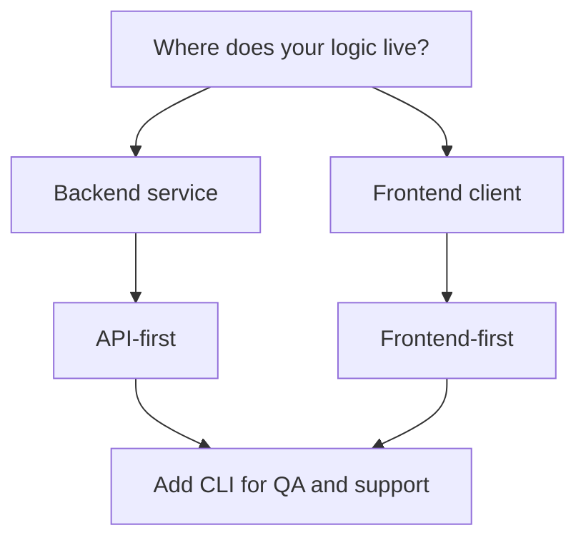

<CardGroup cols={3}>
  <Card title="API-first pattern" icon="code" href="/api/introduction">
    Best when your backend orchestrates payment logic.
  </Card>
  <Card title="Frontend-first pattern" icon="globe" href="/explore/frontend-experience">
    Best when you want rapid UX iteration first.
  </Card>
  <Card title="CLI-assisted pattern" icon="terminal" href="/reference/cli">
    Best for scripted demos and local validation.
  </Card>
</CardGroup>

## Integration decision tree

## Pattern 1: API-first

<Steps>
  <Step title="Implement key generation and wallet setup">
    Use `/api/keys` and persist secrets in your secure key store.
  </Step>
  <Step title="Implement create/publish flow">
    Use `/api/stealth` and `/api/registry` in one orchestrated backend flow.
  </Step>
  <Step title="Implement recipient discovery">
    Use `/api/stealth` scan endpoint in background jobs or user-triggered checks.
  </Step>
</Steps>

## Pattern 2: Frontend-first

<Steps>
  <Step title="Map user journey in the app">
    Start from `/explore/frontend-experience` and confirm each user action.
  </Step>
  <Step title="Mirror each UI action to API endpoint">
    Attach each frontend event to one backend endpoint and audit payload contracts.
  </Step>
  <Step title="Add fallback CLI scripts">
    Keep a CLI script pack for support and QA parity checks.
  </Step>
</Steps>

## Pattern 3: Hybrid (recommended for teams)

- Product flow in frontend
- Deterministic logic in backend API
- CLI scripts for support, QA, and incident reproduction

<Tip>
For most teams, hybrid gives the best balance of developer speed and operational clarity.
</Tip>
