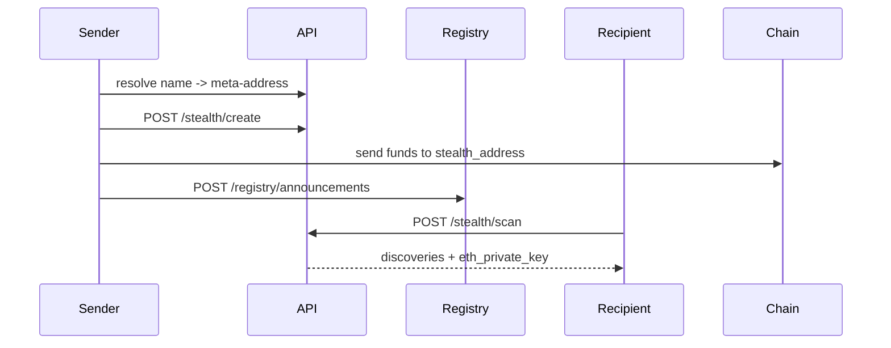

<CardGroup cols={3}>
  <Card title="Launch app" icon="rocket" href="https://specter-stealth.vercel.app/">
    Follow this flow using the hosted UI.
  </Card>
  <Card title="API details" icon="code" href="/api/stealth">
    Endpoint-level request and response schemas.
  </Card>
  <Card title="Quickstart commands" icon="terminal" href="/getting-started/quickstart">
    Copy-paste shell flow for local testing.
  </Card>
</CardGroup>

## End-to-end flow map

## Sender workflow

1. Resolve recipient name to meta-address.
2. Call `POST /api/v1/stealth/create`.
3. Send funds to returned `stealth_address`.
4. Publish announcement with `ephemeral_key`, `view_tag`, and `tx_hash`.

## Recipient workflow

1. Keep `viewing_sk`, `spending_pk`, and `spending_sk` secure.
2. Call `POST /api/v1/stealth/scan` periodically.
3. Import `eth_private_key` into wallet if needed to move funds.

## Verification checks

- Created and discovered `stealth_address` should match.
- Discovery should include the same `announcement_id` and metadata you published.

<strong>Production UX idea: reduce user mistakes</strong>

- Lock the “Publish announcement” button until a valid on-chain `tx_hash` is detected.
- Show a side-by-side confirmation:
  - `stealth_address` generated
  - `stealth_address` discovered
  - final status = match/mismatch
- Save last scan checkpoint (`from_timestamp`) to speed up subsequent scans.

