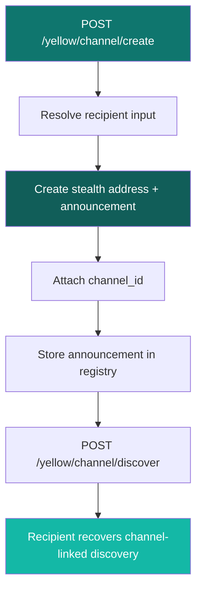

## What this page is for

If the previous page explained **why** Yellow matters, this page explains **how the current implementation behaves**.

## The request flow



## The main endpoints

| Endpoint | What it does now |
| --- | --- |
| `POST /api/v1/yellow/channel/create` | Resolves the recipient, derives a stealth address, creates an announcement, and binds a `channel_id`. |
| `POST /api/v1/yellow/channel/discover` | Scans announcements and returns only channel-linked discoveries. |
| `GET /api/v1/yellow/config` | Returns current websocket and contract config from backend state. |
| `POST /api/v1/yellow/channel/fund` | Exposes a funding API shape, but current response behavior is still simplified. |
| `POST /api/v1/yellow/channel/close` | Returns placeholder-style close output and does not perform backend L1 submission. |

## Example: create a channel-linked announcement

```bash
curl -s -X POST https://backend.specterpq.com/api/v1/yellow/channel/create \
  -H "Content-Type: application/json" \
  -d '{
    "recipient":"bob.eth",
    "token":"USDC",
    "amount":"1000"
  }'
```

## Example: discover incoming channels

```bash
curl -s -X POST https://backend.specterpq.com/api/v1/yellow/channel/discover \
  -H "Content-Type: application/json" \
  -d '{
    "viewing_sk":"<HEX_VIEWING_SK>",
    "spending_pk":"<HEX_SPENDING_PK>",
    "spending_sk":"<HEX_SPENDING_SK>"
  }'
```

## What is source-backed here

- Yellow route handlers: `specter/specter-api/src/handlers.rs`
- Yellow default config: `specter/specter-api/src/state.rs`
- Yellow client and channel types: `specter/specter-yellow/src/client.rs`, `specter/specter-yellow/src/channel.rs`, `specter/specter-yellow/src/types.rs`
- Hosted frontend page: `SPECTER-web/src/pages/YellowPage.tsx`

## Current boundary, stated plainly

<AccordionGroup>
  <Accordion title="What is already useful">
    The repo shows how to connect stealth discovery with a private-channel use case.

    That is valuable because it turns SPECTER from a pure payment primitive into a real privacy coordination layer.
  </Accordion>
  <Accordion title="What is still partial">
    The fund and close paths include placeholder-style behavior in the backend.

    You should treat them as integration scaffolding, not final custody settlement guarantees.
  </Accordion>
  <Accordion title="Why this still matters">
    The hardest part in privacy products is often not the cryptography.

    It is attaching the privacy layer to something people already need.

    Yellow is the clearest example of that in this repo.
  </Accordion>
</AccordionGroup>
