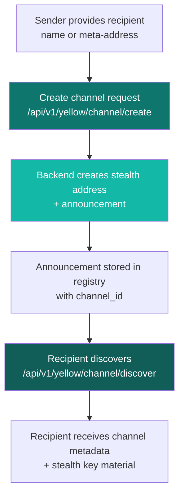

<CardGroup cols={3}>
  <Card title="Use case overview" icon="map" href="/guides/use-cases-and-yellow-integration">
    See what is live now versus roadmap-only use cases.
  </Card>
  <Card title="Yellow API reference" icon="code" href="/api/yellow">
    Review full endpoint schemas and example payloads.
  </Card>
  <Card title="Open Yellow app" icon="rocket" href="https://specterpq.com/yellow">
    Run the hosted frontend path for channel creation and discovery.
  </Card>
</CardGroup>

## Integration flow

## Current backend behavior

<Steps>
  <Step title="Create channel announcement" icon="plus">
    `POST /api/v1/yellow/channel/create` resolves recipient input, builds a stealth address, and publishes an announcement with `channel_id`.
  </Step>
  <Step title="Discover incoming channels" icon="radar">
    `POST /api/v1/yellow/channel/discover` scans announcements and returns channel rows that decode for recipient keys.
  </Step>
  <Step title="Manage channel state" icon="gear">
    `fund`, `transfer`, `status`, and `close` endpoints expose a practical API contract for integration testing.
  </Step>
</Steps>

## Implementation status

| Surface | Status |
| --- | --- |
| Channel create | Implemented and publishes an announcement entry with `channel_id`. |
| Channel discover | Implemented and returns discovered channels from registry scans. |
| Channel fund | Returns a synthetic tx-like hash in current backend behavior. |
| Channel close | Returns placeholder tx hash and sets `tx_hash_is_placeholder: true`. |
| L1 settlement submission | Not submitted by this backend. Settlement execution is expected through Yellow infrastructure. |

<Warning>
Do not treat `fund` and `close` tx hashes as confirmed on-chain transaction hashes in the current backend implementation.
</Warning>

## Configuration defaults

The API exposes defaults through `GET /api/v1/yellow/config`:

- `ws_url`: `wss://clearnet.yellow.com/ws`
- `chain_id`: `11155111` (Sepolia)
- `custody_address`: `0x019B65A265EB3363822f2752141b3dF16131b262`
- `adjudicator_address`: `0x7c7ccbc98469190849BCC6c926307794fDfB11F2`
- `supported_tokens`: USDC and ETH entries

## Source-backed references

- Route wiring: `specter/specter-api/src/routes.rs`
- Endpoint behavior: `specter/specter-api/src/handlers.rs`
- Runtime config defaults: `specter/specter-api/src/state.rs`
- Yellow integration crate: `specter/specter-yellow/src/`
- Frontend Yellow page: `SPECTER-web/src/pages/YellowPage.tsx`
