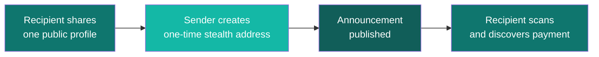

## Welcome to SPECTER

SPECTER lets you receive funds at **private one-time addresses** so observers cannot link payments back to your identity. It uses **post-quantum cryptography** (ML-KEM-768) to future-proof your privacy against quantum attacks.

<CardGroup cols={3}>
  <Card title="Launch App" icon="rocket" href="https://specter-stealth.vercel.app/">
    Try the full experience — no setup required.
  </Card>
  <Card title="What is SPECTER?" icon="sparkles" href="/getting-started/first-time-overview">
    Understand everything in plain language with diagrams.
  </Card>
  <Card title="API Reference" icon="code" href="/api/introduction">
    Go endpoint-by-endpoint for integration.
  </Card>
</CardGroup>

---

## Get Started in 3 Steps

<Steps>
  <Step title="Learn the Model" icon="lightbulb">
    Open the **[What is SPECTER?](/getting-started/first-time-overview)** page for a beginner-friendly walkthrough with analogies, diagrams, and a technical deep-dive.
  </Step>
  <Step title="Explore the Product" icon="globe">
    **[Launch the app](https://specter-stealth.vercel.app/)** and follow the **[product tour](/explore/frontend-experience)** to see the Setup → Send → Scan flow visually before writing code.
  </Step>
  <Step title="Integrate with Your App" icon="plug">
    Use the **[API docs](/api/introduction)** for backend integrations, the **[CLI reference](/reference/cli)** for local workflows, or the **[integration playbook](/guides/integration-playbook)** for guided patterns.
  </Step>
</Steps>

---

## How It Works

---

## Navigate the Docs

<CardGroup cols={2}>
  <Card title="Explore Product" icon="globe" href="/explore/frontend-experience">
    Frontend-first product tour with screenshots and integration handoff.
  </Card>
  <Card title="Integration Playbook" icon="map" href="/guides/integration-playbook">
    Pick a practical integration path by use case.
  </Card>
  <Card title="Roadmap" icon="flag" href="/roadmap/yet-to-implement">
    Track planned features not yet implemented.
  </Card>
  <Card title="FAQ" icon="circle-question" href="/faq">
    Detailed answers for beginners and integrators.
  </Card>
</CardGroup>

<Info>
New to privacy protocols? Start with **[What is SPECTER?](/getting-started/first-time-overview)** — no crypto knowledge required.
</Info>
