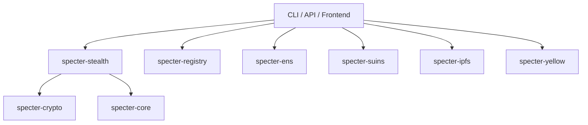

SPECTER is a Rust-based protocol and API for private payment discovery using post-quantum key encapsulation.

It currently ships:

- ML-KEM-768 key generation, encapsulation, and decapsulation
- Stealth address derivation for Ethereum and Sui
- Announcement creation, publishing, and scanning with 1-byte view tags
- ENS and SuiNS name resolution via IPFS-hosted meta-addresses
- REST API, CLI, and Yellow Network integration scaffolding

<Warning>
This documentation only covers behavior verified from the repository code under `SPECTER/specter`. Claims from the long-form README that are not implemented are flagged in `reference/discrepancies-readme`.
</Warning>

## Who this is for

- Developers integrating private payment flows into apps
- Teams operating the SPECTER backend API
- Contributors extending core crates (`specter-core`, `specter-crypto`, `specter-stealth`, and related crates)

## High-level architecture

## Start here

1. Install and run locally: `getting-started/installation`
2. Run a full 5-minute flow: `getting-started/quickstart`
3. Review protocol internals: `core-concepts/protocol-flow`
4. Integrate API endpoints: `api/introduction`

## Implementation status

<Info>
SPECTER is production-oriented but still evolving. Some Yellow and roadmap-style features are placeholders or partial implementations. See `reference/discrepancies-readme`.
</Info>

## Source references

- `../SPECTER/specter/Cargo.toml`
- `../SPECTER/specter/specter-core/src/lib.rs`
- `../SPECTER/specter/specter-api/src/routes.rs`
