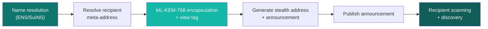

## Build private payments with post-quantum security

SPECTER lets you receive funds at one-time **stealth addresses** so observers cannot link payments back to you. It uses **ML-KEM-768** for recipient privacy against classical and quantum-capable adversaries.

<CardGroup cols={3}>
  <Card title="Launch app" icon="rocket" href="https://specterpq.com/">
    Open the hosted experience on the official domain.
  </Card>
  <Card title="Use cases + Yellow" icon="sitemap" href="/guides/use-cases-and-yellow-integration">
    Start from the live Yellow integration and roadmap boundaries.
  </Card>
  <Card title="API reference" icon="code" href="/api/introduction">
    Integrate endpoint-by-endpoint with verified request/response contracts.
  </Card>
</CardGroup>

## Official domains

- Primary: [specterpq.com](https://specterpq.com)
- Mirror: [specterpq.info](https://specterpq.info)

## Architecture at a glance

```mermaid
flowchart LR
    A["Name resolution\n(ENS/SuiNS)"] --> B["Resolve recipient\nmeta-address"]
    B --> C["ML-KEM-768 encapsulation\n+ view tag"]
    C --> D["Generate stealth address\n+ announcement"]
    D --> E["Publish announcement"]
    E --> F["Recipient scanning\n+ discovery"]

    style A fill:#0f766e,color:#fff
    style C fill:#14b8a6,color:#fff
    style F fill:#115e59,color:#fff
```

## Quick paths

<CardGroup cols={2}>
  <Card title="What is SPECTER?" icon="sparkles" href="/getting-started/first-time-overview">
    Read a beginner-friendly explanation with diagrams.
  </Card>
  <Card title="Playground" icon="bolt" href="/explore/playground">
    Run copy-paste API flows and test the Yellow path.
  </Card>
  <Card title="Protocol flow" icon="sitemap" href="/core-concepts/protocol-flow">
    Follow registration, sending, and recipient discovery.
  </Card>
  <Card title="Contact and feedback" icon="mail" href="/explore/contact-feedback">
    Send docs or integration feedback directly by email.
  </Card>
</CardGroup>

## Core properties

| Property | Detail |
| --- | --- |
|  Post-quantum privacy | ML-KEM-768 encapsulation for shared-secret derivation. |
|  Fast scanning | 1-byte view tags filter most non-matching announcements. |
|  Multi-surface integration | Backend API, frontend app, and CLI share the same core primitives. |

<Info>
If you are new, start with **[What is SPECTER?](/getting-started/first-time-overview)**, then run the **[Playground](/explore/playground)**.
</Info>
