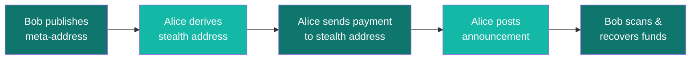

<Frame>
  
</Frame>

## Your wallet address shouldn't be your identity

Every time someone pays you on Ethereum, your address becomes a little less private. Employers, clients, strangers on Etherscan... they can all follow the money back to you.

SPECTER fixes the receiving side. You publish one public profile. Every sender derives a **fresh, one-time address** from it. To the rest of the world, those payments look completely unrelated to you.

And the privacy layer is built with **ML-KEM-768**, a NIST-standardized post-quantum algorithm. So even if quantum computers arrive in 10 years, the payments you receive today stay private.

<CardGroup cols={3}>
  <Card title="Try it right now" icon="play" href="/explore/playground">
    Hit the API, generate keys, create a stealth payment. Takes 2 minutes.
  </Card>
  <Card title="How does this work?" icon="sitemap" href="/how-it-works/protocol-flow">
    The full payment flow, step by step. No PhD required.
  </Card>
  <Card title="Launch the app" icon="rocket" href="https://specterpq.com/">
    Use SPECTER in your browser.
  </Card>
</CardGroup>

---

## Pick your starting point

Not everyone reads docs the same way. Here's where to go based on what you care about.

<Tabs>
  <Tab title="New to this">
    Start with **[The Problem](/why-specter/the-problem)** to understand why blockchain privacy matters, then read **[How SPECTER Works](/why-specter/how-specter-works)** for the plain-language version.

    If you're curious about post-quantum stuff, **[PQ Crypto for Humans](/deep-dive/post-quantum-explainer)** breaks it down without the jargon.
  </Tab>
  <Tab title="Builder">
    Jump to the **[Playground](/explore/playground)** and hit some endpoints. Then read the **[API Quickstart](/getting-started/quickstart)** and **[Integration Guide](/build/integration-guide)**.

    The full API reference lives in the **API reference** tab up top.
  </Tab>
  <Tab title="Evaluating / Investing">
    Read **[The Problem](/why-specter/the-problem)** and **[SPECTER vs Others](/why-specter/specter-vs-others)** for positioning. Check **[Security Boundaries](/how-it-works/security-boundaries)** for honest limitations. The **[ERC Proposal](/deep-dive/erc-proposal)** shows the standardization path.
  </Tab>
  <Tab title="PQ crypto expert">
    Go straight to **[Post-Quantum Crypto](/how-it-works/post-quantum-crypto)** for ML-KEM-768 implementation details, **[Security Boundaries](/how-it-works/security-boundaries)** for the receiving-vs-spending split, and the **[ERC Proposal](/deep-dive/erc-proposal)** for the formal specification.
  </Tab>
</Tabs>

---

## The 30-second version

```mermaid
flowchart LR
    A["Bob publishes\nmeta-address"] --> B["Alice derives\nstealth address"]
    B --> C["Alice sends payment\nto stealth address"]
    C --> D["Alice posts\nannouncement"]
    D --> E["Bob scans &\nrecovers funds"]

    style A fill:#0F766E,color:#fff
    style B fill:#14B8A6,color:#fff
    style C fill:#0F766E,color:#fff
    style D fill:#14B8A6,color:#fff
    style E fill:#0F766E,color:#fff
```

1. **Bob** generates ML-KEM keys and publishes a meta-address (like a public profile)
2. **Alice** uses that meta-address to derive a fresh one-time stealth address
3. **Alice** sends ETH/tokens to that address and posts a coded announcement
4. **Bob** scans announcements with his private key, finds the payment, and spends it

Nobody watching the chain can link the stealth address back to Bob.

---

## What makes SPECTER different

| | SPECTER | Classical stealth (Umbra/Fluidkey) |
|---|---|---|
| **Discovery crypto** | ML-KEM-768 (post-quantum) | ECDH (broken by quantum) |
| **Harvest-now-decrypt-later safe** | Yes | No |
| **View tag scanning** | ~1-2s for 100k announcements | 10-15s |
| **Multi-chain** | Ethereum + Sui | Ethereum only |
| **Name service integration** | ENS + SuiNS | ENS |
| **NIST standard** | FIPS 203 | N/A |

<Tip>
If you only read three pages, make them **[The Problem](/why-specter/the-problem)**, **[Protocol Flow](/how-it-works/protocol-flow)**, and **[Security Boundaries](/how-it-works/security-boundaries)**.
</Tip>

---

## Get in touch

<CardGroup cols={3}>
  <Card title="GitHub" icon="github" href="https://github.com/pranshurastogi/SPECTER">
    Source code, issues, and feature requests.
  </Card>
  <Card title="Email" icon="envelope" href="mailto:pranshurastogi3196@gmail.com">
    pranshurastogi3196@gmail.com for questions, partnerships, or support.
  </Card>
  <Card title="SPECTER on X" icon="message-circle" href="https://x.com/specter_PQ">
    Follow @specter_PQ for protocol updates.
  </Card>
</CardGroup>

<Tip>
  Built by [Pranshu Rastogi](https://x.com/pranshurastogii) ([@pranshurastogii](https://x.com/pranshurastogii)). Questions, ideas, or collab? Reach out anytime.
</Tip>
