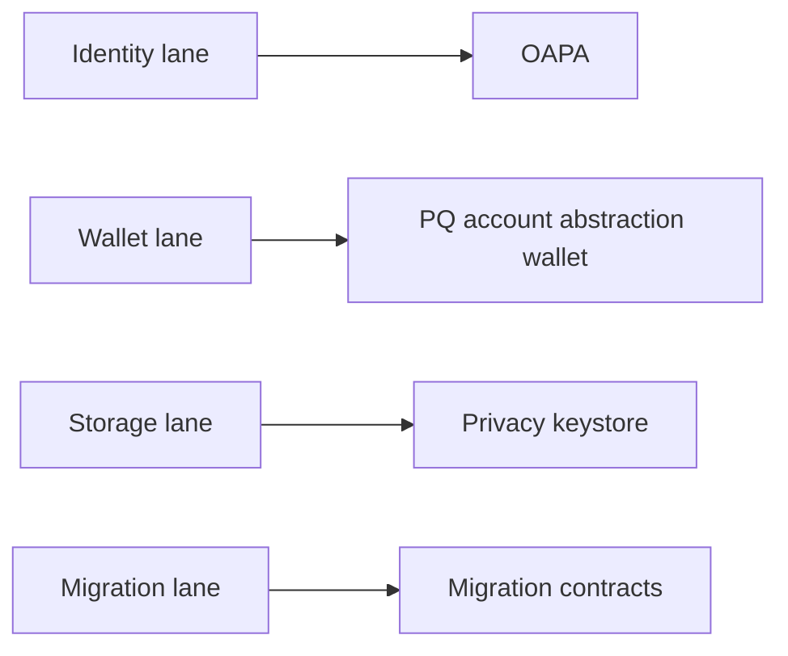

<Warning>
These features are roadmap-only today. They are not implemented modules in the current Rust workspace.
</Warning>

## Scope in this page

<CardGroup cols={2}>
  <Card title="OAPA" icon="flag">
    One address per application identity derivation.
  </Card>
  <Card title="PQ account abstraction wallet" icon="shield-halved">
    Post-quantum smart account wallet track.
  </Card>
  <Card title="Privacy keystore" icon="box">
    Encrypted privacy-preserving keystore system.
  </Card>
  <Card title="Migration contracts" icon="link">
    Legacy-to-post-quantum migration contract flow.
  </Card>
</CardGroup>

## Verification status

| Feature | Implemented now | Status | Priority |
| --- | --- | --- | --- |
| OAPA | No | Planned | High |
| PQ account abstraction wallet | No | Planned | High |
| Privacy keystore | No | Planned | Medium |
| Migration contracts | No | Planned | High |

## Suggested implementation sequence

<Steps>
  <Step title="Identity lane">
    Add OAPA derivation primitives and deterministic app-scoped identity APIs.
  </Step>
  <Step title="Wallet lane">
    Introduce post-quantum account abstraction wallet contracts and validation flow.
  </Step>
  <Step title="Storage lane">
    Add privacy keystore encryption and key rotation paths.
  </Step>
  <Step title="Migration lane">
    Ship legacy-to-PQ migration contracts and registry tooling.
  </Step>
</Steps>

## Roadmap lanes

<AccordionGroup>
  <Accordion title="Why these are marked not implemented">
    The current workspace crate list does not include dedicated modules implementing OAPA, PQ account abstraction wallet contracts, privacy keystore, or migration contracts.
  </Accordion>
  <Accordion title="When to move a feature out of this page">
    Move a feature to standard docs only after code lands in the workspace with tests and API/CLI usage paths.
  </Accordion>
</AccordionGroup>

<Info>
This page is the canonical place for high-impact roadmap items that are planned but not shipped.
</Info>
